# Adhesion Protein Molecular Properties & Functional Domain Survey

## Scope

- 749697 adhesion-predicted proteins across the matched species set.
- 749697 background (non-adhesion) proteins sampled 1:1 per species
  for comparison (seed=42, reproducible).

**Regenerating this report:** `protein_universe.csv` and `protein_domain_flags.csv`
(read by this script) are not tracked in git — they are large
(~163MB/~78MB), fully reproducible per-protein intermediate tables.
Regenerate them first with `01_build_protein_universe.py` and
`02_query_functional_domains.py` (and `03_compute_sequence_properties.py`
/ `04_aggregate_and_test.py` for the other inputs this script and its
upstream tables depend on) before re-running this script.

## Domain/topology presence: adhesion vs. background

```
           feature  adhesion_fraction  background_fraction
          has_pfam           0.401193             0.710767
          has_cazy           0.198748             0.038163
        has_merops           0.005957             0.029559
has_signal_peptide           0.706665             0.062824
      has_tm_helix           0.115930             0.179031
```

## Length and Ser/Thr/Pro content: adhesion vs. background, by phylum

Mann-Whitney U test (adhesion vs. background, within each well-powered
phylum), BH-corrected across phyla:

**Length:**
```
            phylum  n_adhesion  n_background  median_adhesion  median_background       u_stat       p_value    p_value_bh
        Ascomycota      555861        555861            345.0              400.0 1.416686e+11  0.000000e+00  0.000000e+00
     Basidiomycota      135340        135340            310.0              362.0 8.326952e+09  0.000000e+00  0.000000e+00
Blastocladiomycota         938           938            410.0              433.0 4.339380e+05  6.100173e-01  6.100173e-01
   Chytridiomycota       14817         14817            432.0              364.0 1.266646e+08 1.769702e-116 5.309106e-116
      Cryptomycota          40            40            303.0              319.5 8.850000e+02  4.161325e-01  4.681490e-01
     Microsporidia          65            65            471.0              346.0 2.423500e+03  1.482347e-01  1.905874e-01
      Mucoromycota       23786         23786            302.0              322.0 3.005379e+08  4.621646e-32  1.039870e-31
  Sanchytriomycota          28            28            445.5              323.0 5.250000e+02  2.991182e-02  4.486773e-02
     Zoopagomycota       18647         18647            338.0              357.0 1.709071e+08  4.567340e-03  8.221211e-03
```

**Ser+Thr+Pro %:**
```
            phylum  n_adhesion  n_background  median_adhesion  median_background       u_stat       p_value    p_value_bh
        Ascomycota      555861        555861        30.331126          18.723404 2.739534e+11  0.000000e+00  0.000000e+00
     Basidiomycota      135340        135340        26.992825          20.041754 1.421713e+10  0.000000e+00  0.000000e+00
Blastocladiomycota         938           938        27.333661          19.499717 6.892610e+05 3.013677e-100 4.520516e-100
   Chytridiomycota       14817         14817        26.528926          17.902542 1.751937e+08  0.000000e+00  0.000000e+00
      Cryptomycota          40            40        27.520142          17.291516 1.311000e+03  9.001945e-07  1.012719e-06
     Microsporidia          65            65        26.229508          16.167665 3.006500e+03  3.176683e-05  3.176683e-05
      Mucoromycota       23786         23786        23.868313          17.802028 3.770963e+08  0.000000e+00  0.000000e+00
  Sanchytriomycota          28            28        28.011540          16.142568 7.380000e+02  1.499221e-08  1.927570e-08
     Zoopagomycota       18647         18647        28.200371          18.371608 2.847865e+08  0.000000e+00  0.000000e+00
```

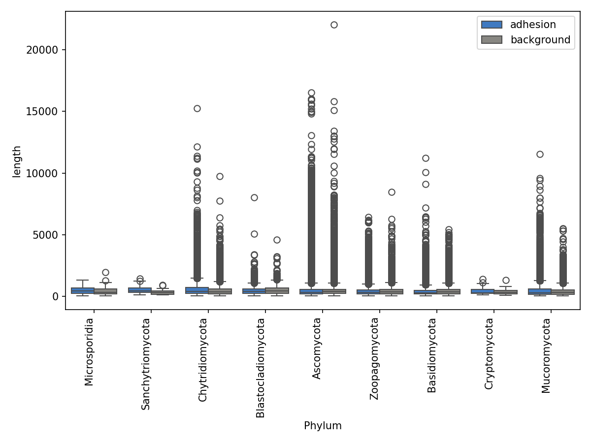

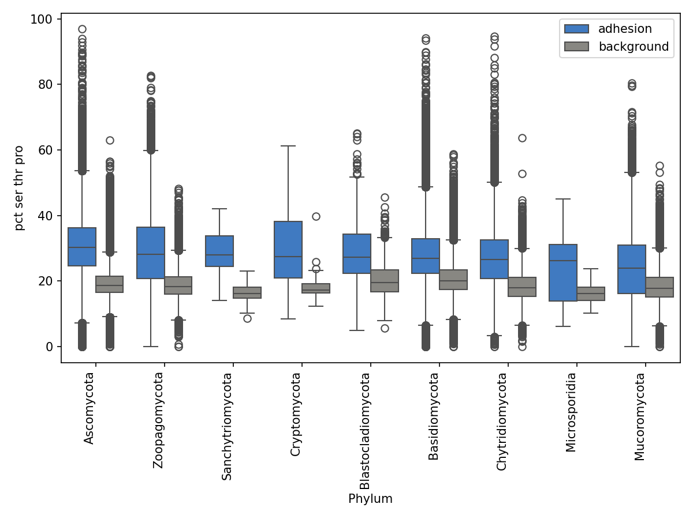

## Domain presence by phylum

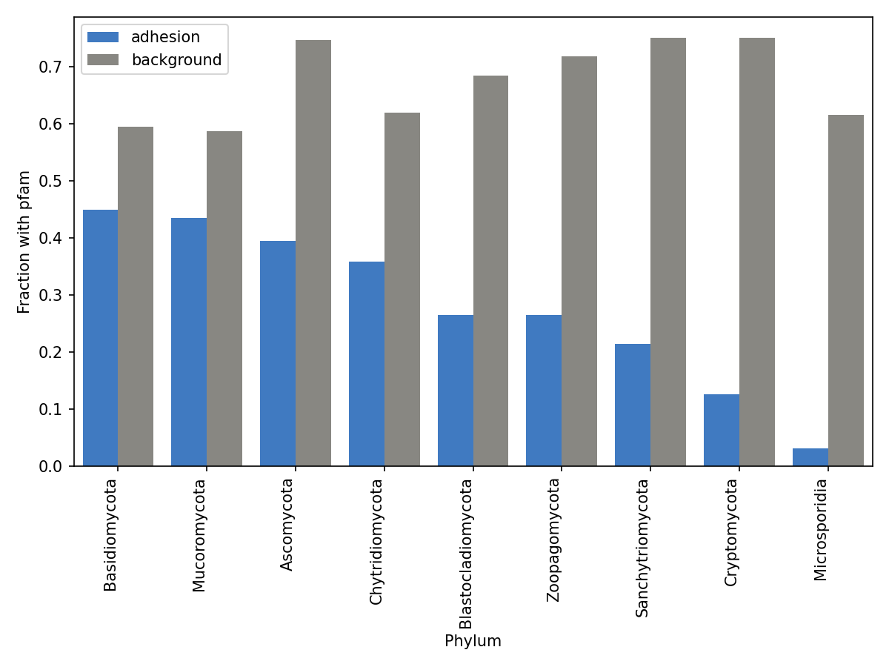

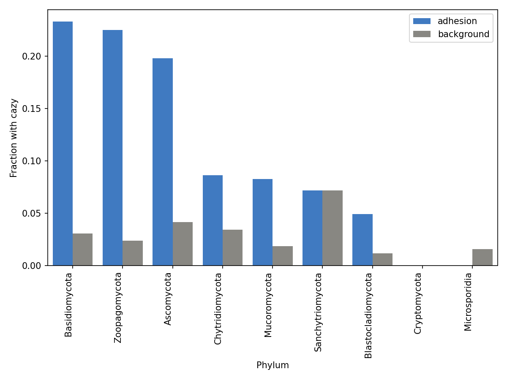

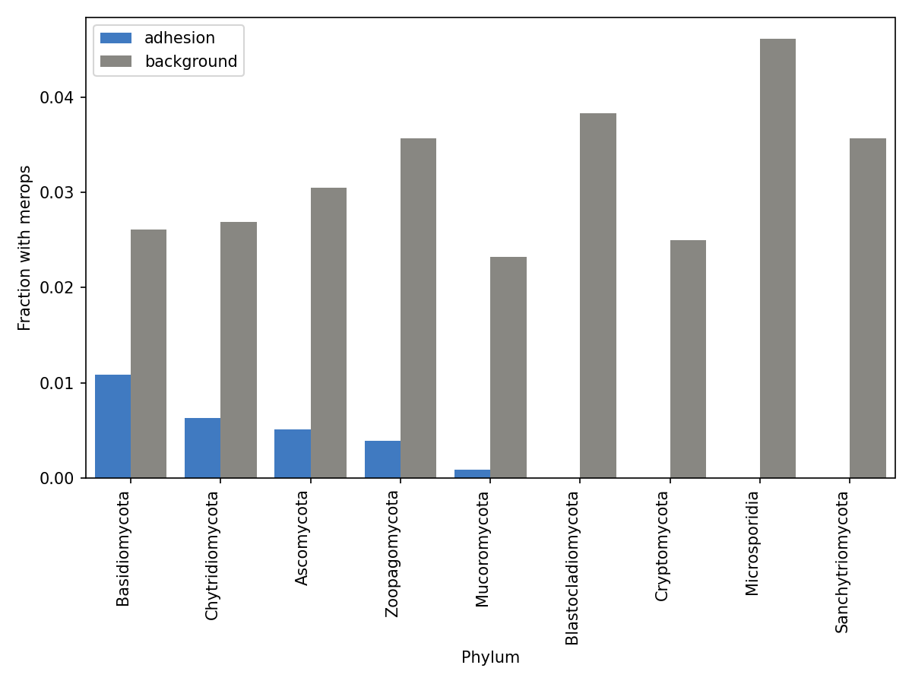

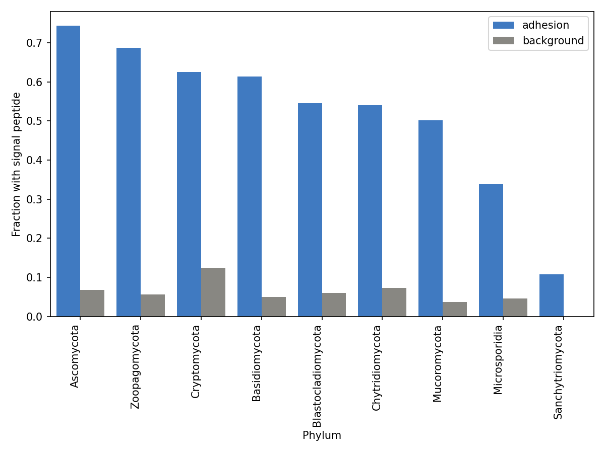

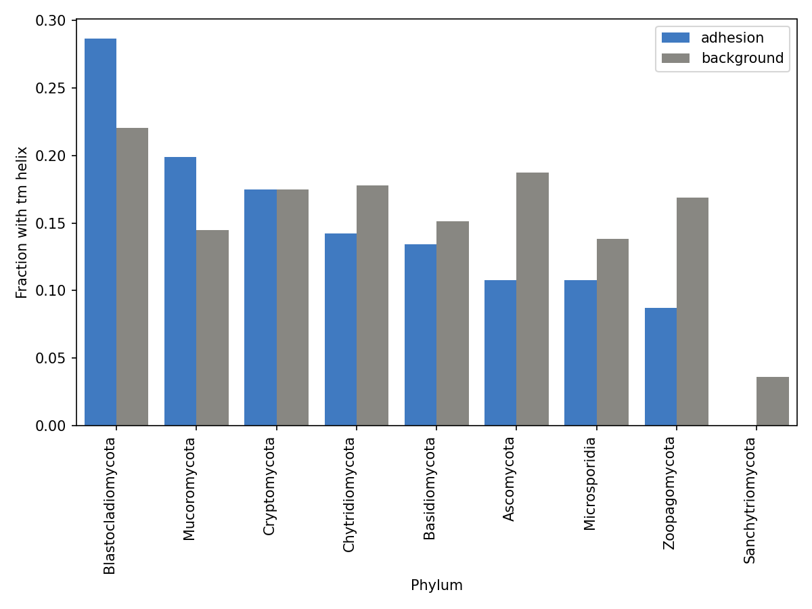

## Top enriched Pfam domains among adhesion proteins

```
      domain_id  adhesion_count  adhesion_rate  background_count  background_rate  enrichment_ratio
             3D               6       0.000008                 0              0.0               inf
 Apolipoprotein               9       0.000012                 0              0.0               inf
Cu-binding_MopE               6       0.000008                 0              0.0               inf
 Pericardin_rpt               5       0.000007                 0              0.0               inf
Lustrin_cystein               9       0.000012                 0              0.0               inf
   Cupredoxin_1              27       0.000036                 0              0.0               inf
     Curlin_rpt               6       0.000008                 0              0.0               inf
       Lectin_C              13       0.000017                 0              0.0               inf
   LbR_Ice_bind              12       0.000016                 0              0.0               inf
    Laminin_G_2               5       0.000007                 0              0.0               inf
```

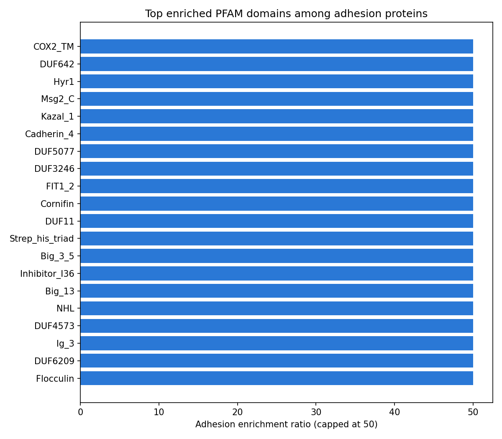

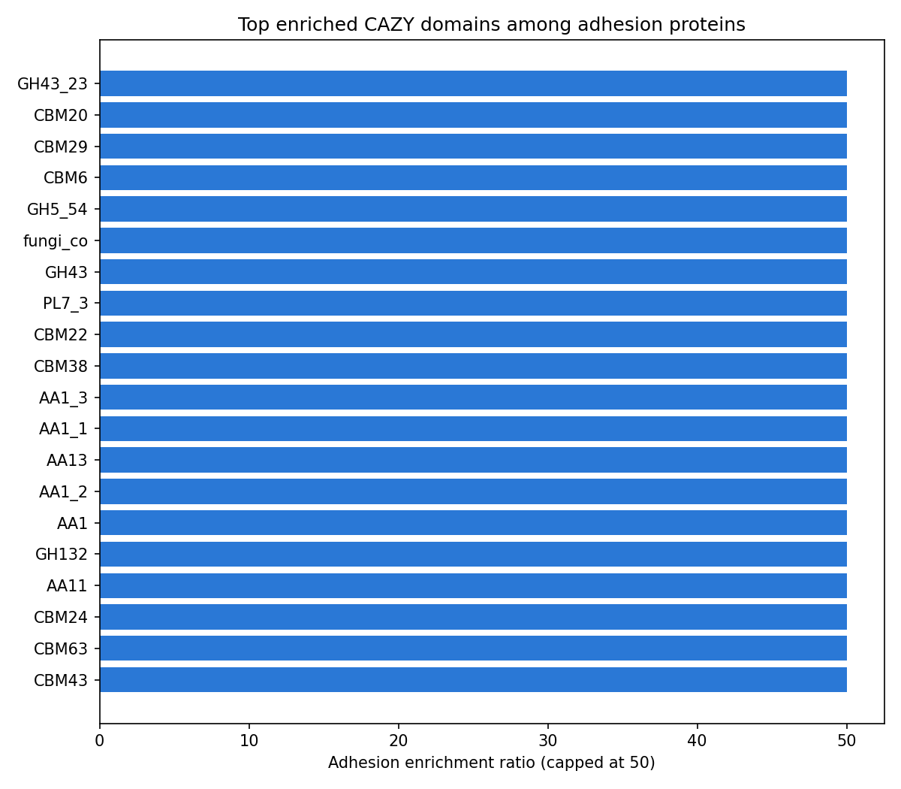

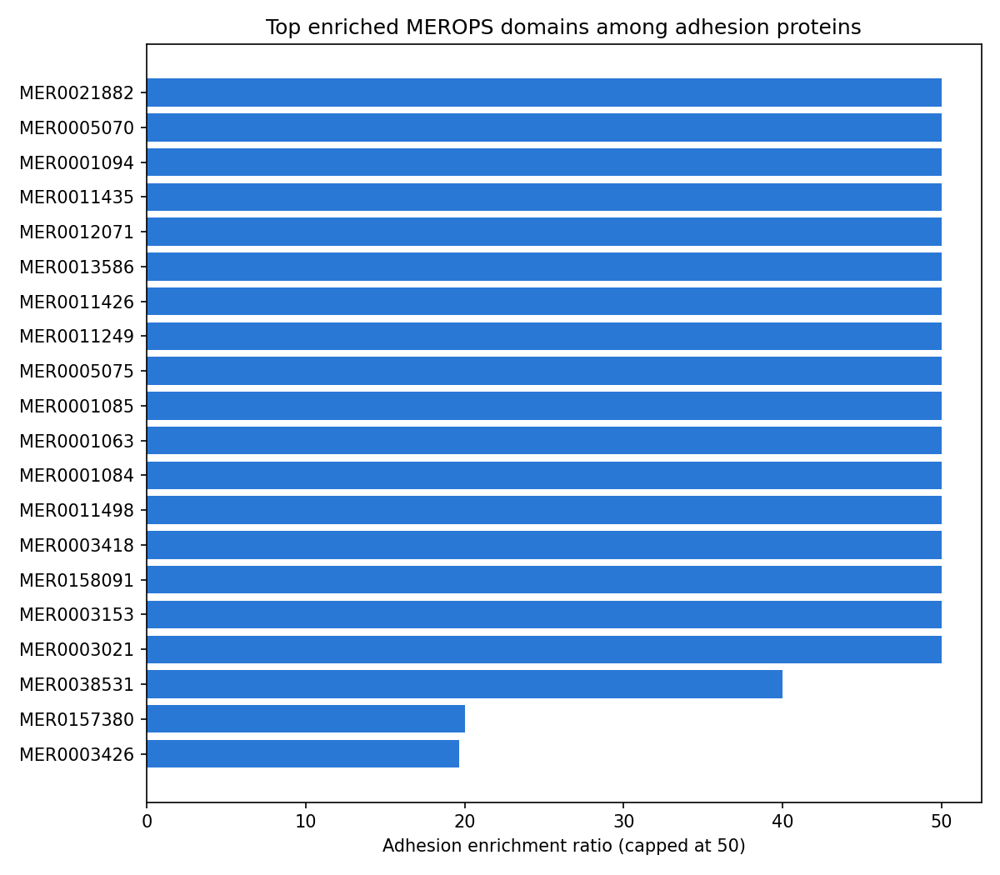

## Correlation with model confidence

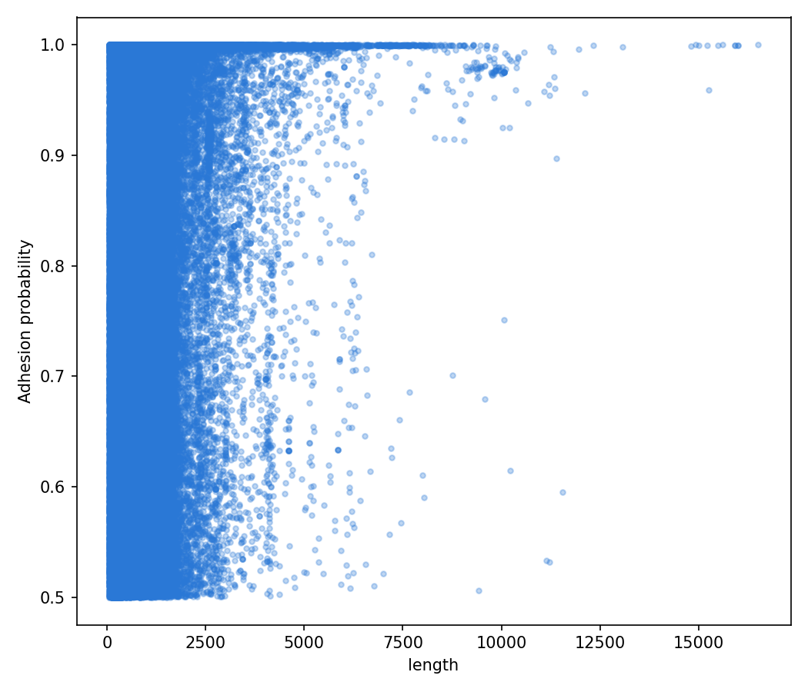

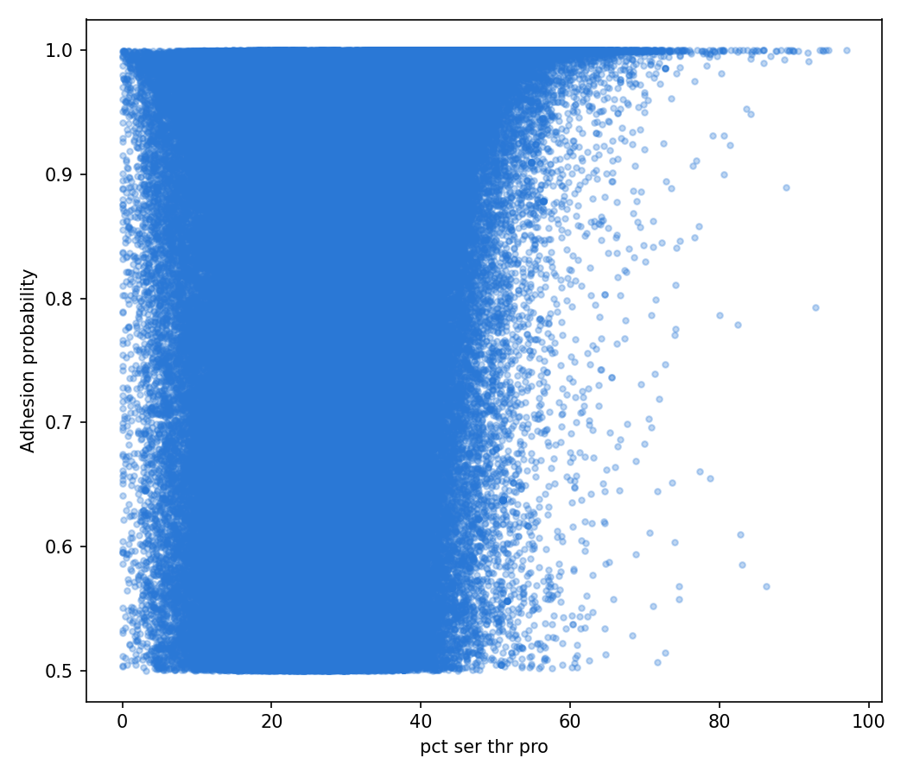

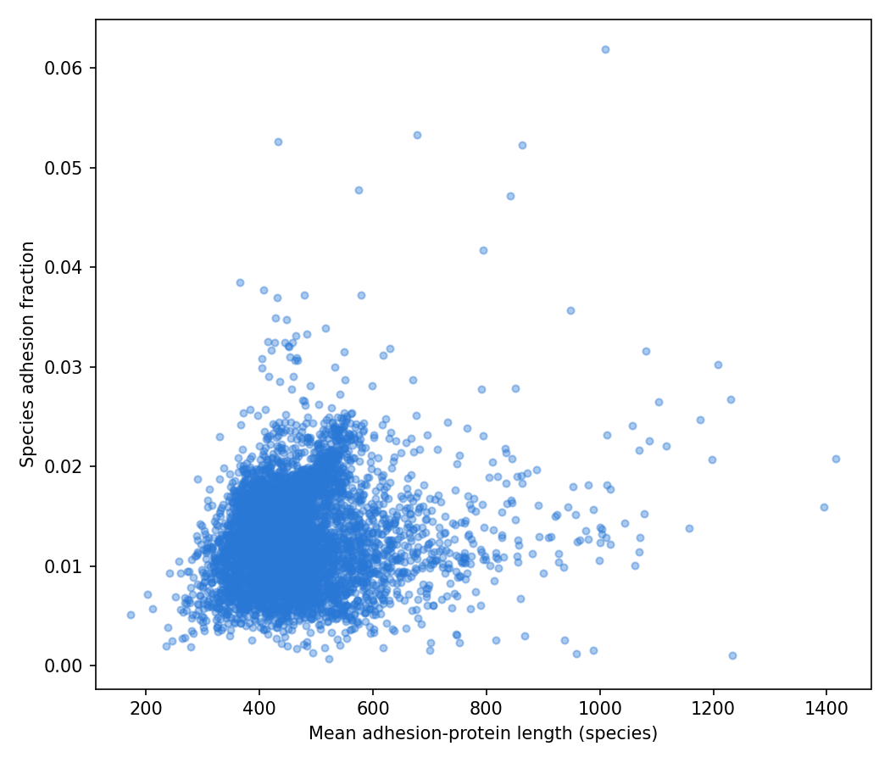

## Headline findings

Adhesion-predicted proteins are consistently enriched for serine+threonine+proline
content relative to their species-matched background across every one of the 9
phyla tested (`tables/clade_phylum_pct_ser_thr_pro_mannwhitney.csv`), and this
holds up after BH correction in all 9: Ascomycota (median 30.3% adhesion vs.
18.7% background, n=555,861 each, p_bh≈0), Basidiomycota (27.0% vs. 20.0%,
n=135,340 each, p_bh≈0), Chytridiomycota (26.5% vs. 17.9%, n=14,817 each,
p_bh≈0), Mucoromycota (23.9% vs. 17.8%, n=23,786 each, p_bh≈0), Zoopagomycota
(28.2% vs. 18.4%, n=18,647 each, p_bh=0), and even the small-n phyla —
Blastocladiomycota (27.3% vs. 19.5%, n=938, p_bh≈4.5e-100), Cryptomycota
(27.5% vs. 17.3%, n=40, p_bh≈1.0e-06), Microsporidia (26.2% vs. 16.2%, n=65,
p_bh≈3.2e-05) and Sanchytriomycota (28.0% vs. 16.1%, n=28, p_bh≈1.9e-08).
The direction and roughly 6-10 percentage-point magnitude are uniform across
the whole fungal tree sampled here — a pattern consistent with Ser/Thr/Pro-rich,
mucin-like or GPI-anchor-proximal sequence stretches that are a recognized
structural hallmark of fungal cell-wall adhesins (e.g. FLO/EPA/Als-family
proteins), since Ser/Thr residues are the attachment sites for the
O-mannosylation that decorates these surface proteins.

Length shows no such uniform pattern (`tables/clade_phylum_length_mannwhitney.csv`):
in the two best-powered phyla, adhesion proteins are actually *shorter* than
background (Ascomycota: median 345 vs. 400 aa, n=555,861 each, p_bh≈0;
Basidiomycota: 310 vs. 362 aa, n=135,340 each, p_bh≈0), as are Mucoromycota
(302 vs. 322 aa, p_bh≈4.6e-32) and Zoopagomycota (338 vs. 357 aa, p_bh≈0.0082),
while Chytridiomycota goes the other way (432 vs. 364 aa, p_bh≈5.3e-116) and
Blastocladiomycota, Cryptomycota, and Microsporidia show no significant
difference after correction (p_bh=0.61, 0.47, 0.19 respectively). So unlike
Ser/Thr/Pro content, length is not a lineage-independent signature of the
adhesion-predicted set.

Visually, neither `figures/scatter_length_vs_probability.png` nor
`figures/scatter_pct_ser_thr_pro_vs_probability.png` shows a discernible trend:
in both plots the classifier's predicted probability spans its full 0.5-1.0
range densely at essentially every length and every Ser/Thr/Pro percentage,
with no visible upward or downward slope in the point cloud — model confidence
does not appear to track either feature. `figures/scatter_species_mean_length_vs_fraction.png`
is similarly a diffuse cloud centered around 400-500 aa mean length and a
1-2% species adhesion fraction, with no visible trend as mean length
increases toward 1000-1400 aa.

Domain/topology presence also diverges sharply from length in how consistent
it is across phyla: adhesion proteins carry a signal peptide far more often
than background in every phylum checked (e.g. Ascomycota 74.3% vs. 6.7%,
Basidiomycota 61.4% vs. 4.9%; `tables/clade_phylum_domain_fractions.csv`),
consistent with these being predicted secreted/cell-surface proteins, while
carrying a MEROPS peptidase hit and a TM helix *less* often than background
(Ascomycota MEROPS 0.5% vs. 3.1%, TM helix 10.8% vs. 18.8%) and an overall
Pfam hit less often too (Ascomycota 39.4% vs. 74.7%) — i.e. a large fraction
of the adhesion set carries no recognized Pfam domain at all, consistent with
many fungal adhesins being fast-evolving, repeat-rich, poorly conserved
sequences that escape standard domain databases.

Among proteins that *do* have a domain hit, the specific families point at a
coherent cell-surface/carbohydrate-interaction narrative rather than a random
grab-bag. In `tables/top_domains_pfam.csv`, the top Pfam hits among
adhesion-predicted proteins include Lectin_C (13 adhesion hits, 0 background)
and two laminin domains, Laminin_G_2 and Laminin_EGF (5 and 14 adhesion hits,
0 background) — all three are extracellular carbohydrate/glycoprotein-binding
modules of the kind found in cell-adhesion proteins — alongside Kazal_1 (97
adhesion hits, the single highest count in the table, 0 background) and
DUF11 (51 hits), a domain of unknown function repeatedly reported in fungal
cell-wall/adhesin-like proteins. In `tables/top_domains_cazy.csv`, the most
enriched families by finite ratio are AA1_3 (12,493 adhesion hits vs. only 2
background, ratio≈6246.5) and AA1_1 (9,279 vs. 5, ratio≈1855.8) — both
"Auxiliary Activity family 1" multicopper-oxidase/laccase domains implicated
in fungal cell-wall remodeling and melanization — plus a cluster of
carbohydrate-binding modules (CBM29, CBM6, CBM43, CBM24, CBM63, CBM20) that
have no catalytic activity of their own but mediate binding to cell-wall or
extracellular polysaccharides, exactly the kind of adhesive function this
analysis is targeting. In `tables/top_domains_merops.csv`, one accession,
MER0003426, stands out with by far the largest adhesion count (1,867 hits vs.
95 background, ratio≈19.65) of any entry in that table, well above the two
next most common finite-ratio accessions MER0038531 (40 vs. 1, ratio≈39.99)
and MER0157380 (20 vs. 1, ratio≈19.99); per Caveat 1 below these are
individual reference-sequence accessions rather than resolvable peptidase
family codes, so no functional family name can be attached to them here.

The three top-domain enrichment charts should not be read as showing the
same phenomenon for the same reason. In `figures/top_domains_pfam.png`, all
20 plotted Pfam domains have `background_count=0` — every bar is legitimately
tied at the plot's display cap because there is truly no background
occurrence to divide by (enrichment is infinite, not merely large), so this
chart cannot distinguish relative magnitude among its 20 domains. In
`figures/top_domains_cazy.png`, only 9 of the 20 domains are background-absent
(`inf`); the other 11 (AA1_3, AA1_1, AA13, AA1_2, AA1, GH132, AA11, CBM24,
CBM63, CBM20, GH43_23) have finite but very large enrichment ratios (from
about 73.5 up to about 6246.5) that still exceed the plot's display cap of 50
and so are also drawn at the cap — the chart looks uniform, but for a mixed
reason: some domains are genuinely background-absent, others are merely
extremely (but finitely) enriched. `figures/top_domains_merops.png` is the
one chart of the three that shows real, visible differentiation: while 17 of
its 20 domains are at `inf`/capped, MER0038531 (≈39.99), MER0157380 (≈19.99),
and MER0003426 (≈19.65) all fall below the display cap and are drawn as
visibly shorter bars than the rest — so, unlike the other two charts, the
MEROPS chart is not "every bar tied at the cap."

## Caveats

1. **MEROPS results are accession-level, not family-level** — this
   database has no peptidase family/clan lookup, so MEROPS hit identities
   are individual sequence accessions (e.g. `MER0080922`), not the
   family codes (e.g. "S08") domain experts would recognize; treat the
   MEROPS enrichment table as "has a hit in this specific reference
   sequence's neighborhood," not a family-level functional claim.
2. **`net_charge_ph7` is a coarse approximation** (simple Lys+Arg minus
   Asp+Glu residue count), not a full pKa-based charge model.
3. **Background sampling is random** (seeded, reproducible) — a different
   seed would produce a slightly different background set; the 1:1
   per-species matching mitigates but doesn't eliminate this.
4. **Non-independence across clades** (species within a genus/family
   share ancestry) applies here exactly as it does in the kingdom-wide
   survey — this pass does not repeat that survey's genus-averaging/
   mixed-model correction; treat clade-level patterns here as
   descriptive/hypothesis-generating, not confirmatory.
5. **Multiple testing across features and clades**: the Mann-Whitney
   tables are BH-corrected *within* each (rank, feature) combination, not
   jointly across every feature/rank combination in this report — a
   stricter joint correction would raise the significance bar further.

## Follow-up

Whether an ESM-2 embedding-space clustering reveals distinct sub-types
within the adhesion-predicted set (e.g. FLO11-like vs. Als-like vs. other
architectures) is deferred to a follow-up phase, informed by which
domain/property patterns found here are worth validating against.
