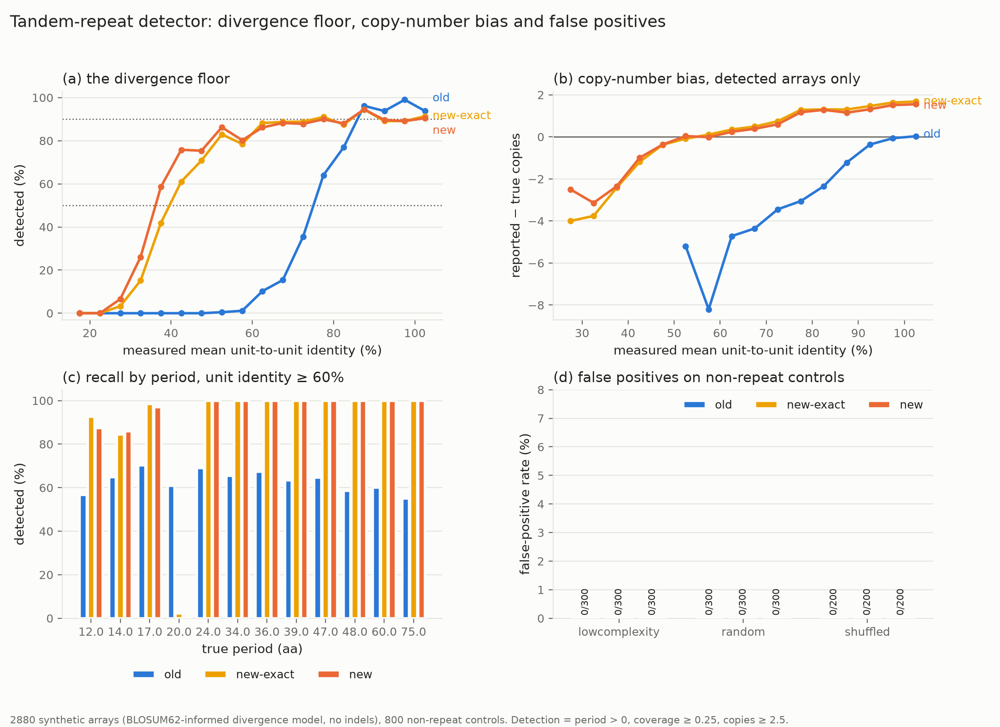

# Tandem-repeat detector: where exact matching breaks, and a family-agnostic replacement

**Working report, 2026-09-29.** Scripts 14-18 in `analysis/cocci_repeats/`.
Follows `docs/reports/2026-09-27-cocci-repeat-surface-proteins.md` (section 4.2) and
`REPORT_2026-09-29_sowgp_repeat_structure.md` (section 2, problem 4).

> **Status: computational results only. No experimental validation.** Most of the divergence
> axis is synthetic. Read section 3.2 and section 7 before using any number here.

---

## 1. Question

`02_repeat_profile.py` scores a period *p* by the fraction of positions where `s[i] == s[i+p]`.
Two limits were suspected and unmeasured.

1. Exact matching must fail once repeat units diverge. At what unit-to-unit identity does it
   fail?
2. Its fractional `n_copies` is lower than the anchored counts (README section 4). By how
   much, and can a detector give integer copy counts without a family-specific motif?

## 2. Summary of findings

| | old (02) | new (14) |
|---|---|---|
| 50% recall reached at unit identity of about | **75%** | **35%** |
| Recall over the whole synthetic set | 36.5% | 78.8% |
| Copy-number error, mean (synthetic, detected) | **-1.43** | **+0.38** |
| Copy-number error, mean absolute | 1.45 | 0.96 |
| Copy-number error at 15 true copies | -3.43 | +0.20 |
| False positives on 800 non-repeat controls | 0 | 0 |
| Real SOWgp alleles detected (of 74) | 62 | **74** |
| Calls on the 71,044 real proteins | 83 | 189 |

- **The divergence floor is about 75% unit identity for exact matching and about 35% for
  similarity matching.** That is the headline number. Both are measured on synthetic arrays
  under an assumed mutation model (section 3.2).
- Similarity matching alone raises the false-positive rate on low-complexity tracts from 0.7%
  to 19.0%. Two composition-based fixes were tried and rejected. What works is a z-score of
  the chosen period against unrelated periods (section 4.3).
- Consensus-PSSM copy counting removes the low bias. It replaces it with a small high bias.
- The new detector cannot call Pro/Gly-rich repeats such as `CGPPDGPGGPGGPPGGPGGP`. Five of
  the 41 curated class-2a candidates are lost. This is a real cost, not a rounding error.

## 3. Method

### 3.1 Three arms

| Arm | Script | Matching | Significance test | Copy count |
|---|---|---|---|---|
| `old` | `02_repeat_profile.py` | exact | raw match rate >= 0.3 | fractional, region width / period |
| `new-exact` | `14 --mode exact` | exact | period z-score >= 4 | integer, consensus PSSM |
| `new` | `14` (default) | BLOSUM62 >= 1 | period z-score >= 4 | integer, consensus PSSM |

`new-exact` separates what the scoring change buys from what the copy-counting change buys.
A sequence counts as detected under the thresholds `03_repeat_surface_candidates.py` uses:
period > 0, coverage >= 0.25, copies >= 2.5. The same rule is applied to all three arms.

### 3.2 The benchmark (`15_repeat_benchmark.py`)

3,795 sequences in four parts.

| Part | n | Truth |
|---|---|---|
| `sowgp` | 74 | Real. Distinct full-length SOWgp alleles with regular anchor spacing. Period 47 aa; copy number is the `PTDCYGDC` anchored count from `sowgp_units.py`, which matches the published SOWgp58/66/82 numbers. |
| `synthetic` | 2,880 | By construction. 12 donor units x 4 copy numbers (3, 5, 8, 15) x 15 target identities (1.00 down to 0.30) x 4 replicates. |
| `negative` | 800 | No repeat. 300 random (proteome composition), 300 low-complexity (a 2-4 letter tract in random flanks), 200 shuffled synthetic positives. |
| `real_candidate` | 41 | None. The class-2a candidates. They were selected by the detector under test, so recall on them is circular. Used only to see which calls survive. |

Synthetic construction: a donor unit is tiled N times, then every copy is mutated
independently. A substitution replaces residue *a* by *b* != *a* with probability proportional
to exp(0.5 x BLOSUM62[*a*,*b*]). The per-site rate is set from the target identity; the
identity actually realised is **measured** after generation and is what every plot uses.
Flanks of random sequence scale with the array, so true coverage always sits near 0.5-0.8 and
the 0.25 coverage threshold is reachable in every cell.

Donors: 6 `native` (real repeat units from `class2a_candidates.tsv`, periods 14, 17, 20, 34,
39, 47) and 6 `background` (drawn from the *C. immitis* RS proteome composition, periods 12,
24, 36, 48, 60, 75).

> **What the synthetic set does and does not measure.** It measures the detector's response
> to divergence under an assumed mutation model. It is not a claim about how natural repeat
> arrays evolve. Concerted evolution, slippage, gene conversion and **indels** are not
> modelled. Indels in particular would break the fixed-period assumption both detectors rest
> on, so every number below is an upper bound on performance at a given identity.

### 3.3 The new detector (`14_repeat_detect_general.py`)

Three changes from 02. `02_repeat_profile.py` is untouched; 03, 05 and 09 still read it.

1. **Similarity, not identity.** A position matches when BLOSUM62(`s[i]`, `s[i+p]`) >= 1.
2. **A composition-free significance test.** The match rate at the chosen period is compared
   with the match rate at every period that is not its multiple or divisor, as a z-score.
   Both the whole protein and the called region must reach z >= 4.
3. **Integer copy counts with no motif anchor.** A consensus unit is taken from the detected
   period, turned into a log-odds PSSM and scanned back over the whole protein. Unit starts
   are chained at about *p* spacing and accepted on the PSSM score, the PSSM is rebuilt from
   the accepted units, and the scan is repeated. All *p* tiling phases are tried and the one
   giving the most accepted units is kept.

## 4. Results

### 4.1 The divergence floor

Recall (%) against the measured mean unit-to-unit identity. 5% bins, labelled by centre.

| identity | 27.5 | 32.5 | 37.5 | 42.5 | 47.5 | 52.5 | 57.5 | 62.5 | 67.5 | 72.5 | 77.5 | 82.5 | 87.5 | 92.5 | 97.5 | 100 |
|---|---|---|---|---|---|---|---|---|---|---|---|---|---|---|---|---|
| old | 0.0 | 0.0 | 0.0 | 0.0 | 0.0 | 0.5 | 1.1 | 10.3 | 15.4 | 35.5 | 64.0 | 77.0 | 96.2 | 93.8 | 99.0 | 93.8 |
| new-exact | 3.3 | 15.2 | 41.9 | 61.1 | 70.9 | 82.9 | 78.5 | 88.2 | 88.7 | 88.8 | 91.0 | 87.5 | 94.5 | 89.1 | 89.1 | 91.4 |
| new | 6.6 | 26.1 | 58.6 | 75.8 | 75.4 | 86.3 | 80.2 | 86.2 | 88.2 | 87.8 | 89.9 | 88.0 | 94.5 | 89.6 | 89.1 | 90.4 |

- **Old crosses 50% recall between 72.5% and 77.5% unit identity.** Call it 75%.
- **New crosses 50% recall between 32.5% and 37.5% unit identity.** Call it 35%.
- **The floor moves by about 40 percentage points of unit identity.**
- Most of that comes from the significance test, not from the substitution matrix.
  `new-exact` still matches residues exactly and already crosses 50% at about 37.5%. The flat
  0.3 cut on the raw match rate in 02, not exact matching by itself, is what kills weak
  signals. Similarity matching adds a further 5 points of identity at the 50% level.
- **Neither new arm reaches 90% recall anywhere.** Both plateau at 87-94%. Two causes: the
  `native` period-20 donor, which the new detector cannot call at all (section 4.4), and the
  coverage >= 0.25 threshold at low copy number. Old does reach 96-99% at >= 85% identity.
  **Above about 85% unit identity the old detector has the higher recall.**

### 4.2 Copy-number bias

Mean of (reported - true), detected arrays only:

| true copies | old | new-exact | new |
|---|---|---|---|
| 3 | 0.00 | +0.59 | +0.53 |
| 5 | -0.59 | +0.54 | +0.43 |
| 8 | -1.41 | +0.56 | +0.39 |
| 15 | -3.43 | +0.46 | +0.20 |
| all | **-1.43** | +0.54 | **+0.38** |
| mean absolute | 1.45 | 1.03 | **0.96** |

- **The old low bias grows with array length.** It is zero at 3 copies and -3.4 at 15. The
  0.2-0.6 gap the README records for SOWgp is the short-array end of this.
- The consensus-PSSM count removes the length-dependent low bias and replaces it with a
  roughly constant high bias of about +0.4 copies. Mean absolute error falls from 1.45 to 0.96.
- The high bias comes from the phase search, which keeps the phase giving the most accepted
  units. That rule was chosen to recover terminal units and it over-shoots by design.

On the 74 real SOWgp alleles, where truth is the anchored unit count:

| | old | new |
|---|---|---|
| detected | 62 / 74 | **74 / 74** |
| period 47 called | all detected | all detected |
| mean copy error | -0.19 | **+0.77** |
| count equals truth | 87.1% after rounding | 24.3% exactly |

**This is a negative result for the new copy counter on real SOWgp.** Its integer count is one
too high in about three quarters of the alleles, while the old fractional count rounds to the
anchored truth 87% of the time. The extra copy is always the same N-terminal segment, in phase
with the array and one period ahead of the first anchor, for example
`SYGDDYGNCKGEKPSATPSHYDEYGYKMRKRGAKEHSYCDTYGCDGP`. It carries the `C..YG..C..YGC` spacing of a
unit but not the `PTDCYGDC` motif, so the anchor method cannot see it. Whether it is a
degenerate extra unit or a coincidental match **is not established here**. If it is real, the
anchored counts in the 2026-09-29 SOWgp report are each one low; checking that needs an
alignment test that was not done.

### 4.3 Low-complexity false positives, and two fixes that did not work

Detection rate on the 300 random 2-4 letter low-complexity tracts:

| detector version | low-complexity FP rate |
|---|---|
| 02, exact matching | 0.7% (2/300) |
| similarity matching, raw rate | **19.0%** (57/300) |
| similarity, corrected for whole-protein composition | 10.7% (32/300) |
| similarity, corrected for the called region's own composition | 0%, but **lost the Ser/Thr-rich candidates** |
| similarity, period z-score (shipped) | **0%** (0/300) |

- Switching to similarity matching costs a 27-fold rise in low-complexity false positives.
  Anyone adopting similarity scoring has to deal with this.
- **Composition correction does not solve it.** A Ser/Thr-rich FLO/ALS-type adhesin repeat and
  a random Ser/Thr tract have the same composition. The region-composition cut removed both:
  it dropped the seven real `TTECEETTTEQPSAPAP` (17 aa) candidates along with the controls.
- What separates them is that a real array matches at **one** period while a random tract
  matches equally at **every** period. The z-score of the chosen period against unrelated
  periods captures this and uses no composition at all. It restores the `TTECEETTTEQPSAPAP`
  calls and takes the controls to zero.
- All three arms give 0 false positives on all 800 controls at the 03 thresholds.

### 4.4 Where the new detector is worse

- **Period-20 Pro/Gly donor: 0.8% recall, against 35.0% for old.** The donor unit is
  `CGPPDGPGGPGGPPGGPGGP`. Its composition is so skewed that the match rate is high at every
  period, so the z-score is near zero and the call is rejected. The same failure hits the real
  proteins (section 5). The z-test cannot tell a genuine Pro/Gly array from a Pro/Gly tract.
- **Period accuracy.** Among detected arrays the reported period is within +-1 of the truth for
  97.0% of old calls and 95.2% of new. Old's errors are multiples of the true period (2.9%);
  new's are divisors (4.6%). The divisor rule in 14 (a smaller period replaces the best period
  when it divides it and scores at least 0.9 as well) fixed the multiples and introduced
  divisors. It is a trade, not an improvement. The real `CIMG_07912` 14 aa repeat is now
  called as 7 aa.
- **Recall ceiling.** Old reaches 96-99% above 85% identity; new plateaus at about 90%.
- **Speed.** The phase search makes 14 about 30-100x slower per protein than 02. The whole
  71,044-protein run still finishes in under 5 minutes on 7 cores.

### 4.5 Hierarchical periods

`unit_period` reports a unit-of-units lag. The known case, the *posadasii* 5-unit allele with
identical units at positions 1, 3 and 4, is reported as `unit_period` 0. **It is not
detected.** The column is shipped as descriptive output only. There is no evidence it works.

## 5. Real data (scripts 17, 18)

The new detector was run on the same 71,044 proteins as 02: the 5 UArizona long-read proteomes
plus the *C. immitis* RS and *C. posadasii* Silveira references.

| threshold | old | new | shared | gained | lost |
|---|---|---|---|---|---|
| 03 (coverage >= 0.25, copies >= 2.5) | 83 | **189** | 66 | 123 | 17 |
| 02 summary (coverage >= 0.3, copies >= 3) | 58 | 185 | 45 | 140 | 13 |

**More calls is not better. The gained calls were inspected.**

- 101 of the 123 gained calls have a period of 25 aa or more. 105 have a repeat region with
  Wootton-Federhen entropy >= 2.5 bits and no residue triple covering more than 60% of the unit.
- 74 of the 123 gained proteins had **no period at all** from 02, not merely a sub-threshold one.
- The largest gained groups are recognisable repeat families, not noise:
  - **33-34 aa (34 proteins): ankyrin repeats.** Units such as
    `NGRTLLHLAAQHGHNSTVKVLITKGDAKVDLKDH` and `QLAVENGHEAVVKLLLSTGRVDATHGVTNDWTPL` carry the
    ankyrin `LHLAA..GH...VKLL..G.A.VD..DH` pattern. These are the expected catch of a
    similarity-scored detector: ankyrin units diverge past the exact-match floor.
  - **51 aa (7 proteins) and 62 aa (8 proteins):** longer helical repeats, one orthologue set
    each across all seven proteomes.
- 18 gained calls look low-complexity by entropy. On inspection they are genuine short-period
  arrays, not random tracts: `QPPPQ` x 7, `VEPE` x 7, `EPKPEPYDPY` x 17, `GGHKH` x 36. They
  pass the z-test because they really do repeat at one period. Whether a `GGHKH` x 36 array is
  a useful class-2a candidate is a biological question this report does not answer.
- **Ankyrin repeats are intracellular.** They are a new false-positive class for class-2a
  curation at the biology level, not at the detector level. The SignalP filter in 03 should
  remove most of them.

The 17 lost calls:

- 12 are low-complexity arrays the new detector rejects on purpose: `GNNG` x 26-40,
  `PEDDEL` x 23, `MNVEG` x 18, `MVELE` x 17, `EEMNIKRINI` x 5.
- **5 are curated class-2a candidates** (`class2a_candidates.tsv`):

  | protein | len | old period | old copies | class |
  |---|---|---|---|---|
  | `CPOS1038_008584-T1` | 394 | 20 | 5.1 | Pro/Cys-rich |
  | `CPOS3700_002661-T1` | 322 | 16 | 6.7 | Pro/Cys-rich |
  | `QVM13252.1` | 242 | 19 | 4.3 | Pro/Cys-rich |
  | `QVM10969.1` | 288 | 20 | 4.5 | Pro/Cys-rich |
  | `QVM06341.1` | 382 | 4 | 26.5 | other (`GNNG`) |

  The first four are the Pro/Gly/Ser-rich failure of section 4.4. `QVM06341.1` is a `GNNG`
  tract and is correctly dropped. Of the 41 curated candidates, the new detector still calls 36.

**The secreted subset was not recomputed.** `03_repeat_surface_candidates.py` needs the
SignalP 6 output, which `01_signalp.sh` writes to the submit directory and which is not in
this repository. So the "41 secreted of 58" figure from the 2026-09-27 report has no
counterpart here. Re-running 01 is the next step.

## 6. What this means for `02_repeat_profile.py`

- 02 is still correct for what it was used for. SOWgp units sit at 96-100% identity, well above
  the 75% floor, and the published SOWgp periods were recovered.
- The 58 proteins that 02 called are not the set of *Coccidioides* proteins with tandem
  repeats. They are the set whose repeat units are more than about 75% identical.
- 02 should not be replaced wholesale. It is better above 85% identity, its period calls are
  cleaner, and its fractional copy count rounds to the anchored SOWgp truth more often. 14 is
  the right tool for finding diverged arrays and for counting copies in long arrays.

## 7. Limits

1. The divergence axis is synthetic. No indels, no concerted evolution, one substitution model,
   one value of its lambda parameter (0.5). The floor numbers are specific to that model.
2. Only 12 donor units. Recall differs a lot between them (`background` donors 89.4%, `native`
   donors 68.1%), so the donor set, not only the divergence, drives the plateau.
3. The real ground truth is one family, SOWgp, at high unit identity. There is no real
   benchmark at 40-60% unit identity. The gained ankyrin calls agree with the synthetic result
   but are not independent truth: no HMM search (PF00023, PF12796) was run to confirm them.
4. `Z_MIN = 4.0`, `PSSM_ACCEPT_FRAC = 0.25` and `PERIOD_DIVISOR_FRAC = 0.9` were set before the
   final evaluation and not tuned on it. They were not optimised either, so the numbers are for
   one arbitrary parameter point.
5. The low-complexity controls are uniform draws from 2-4 letter alphabets. Real low-complexity
   regions are not uniform. The 0% false-positive rate is against the easy null.
6. The SOWgp +1 copy question (section 4.2) is open.
7. `unit_period` is unvalidated.

## 8. Next steps

1. Re-run `01_signalp.sh`, then `03_repeat_surface_candidates.py` on `repeat_general_*.tsv`, to
   get the secreted subset of the 189 calls.
2. Run PFAM HMMs (PF00023 ankyrin, PF13414 TPR, PF08238 Sel1) over the 123 gained calls. That
   gives the first independent check of a diverged-repeat call in this project.
3. Decide whether Pro/Gly-rich arrays matter for class 2a. If they do, the z-test needs a
   companion test for them. If not, the current behaviour is correct and should be documented
   as intended.
4. Settle the SOWgp N-terminal segment: align it to the modal unit and decide whether the
   anchored counts are each one low.
5. Add indels to the synthetic set and re-measure the floor. A fixed-period detector should
   degrade fast, and neither detector has been tested for it.

## 9. Files

| File | Contents |
|---|---|
| `14_repeat_detect_general.py` | The new detector. Importable (`detect(seq, mode=)`) and a CLI whose TSV columns are a superset of 02's. |
| `15_repeat_benchmark.py` | `repeat_benchmark.fa`, `repeat_benchmark_truth.tsv` |
| `16_repeat_benchmark_eval.py` | [`plots/repeat_benchmark.png`](plots/repeat_benchmark.png), `repeat_benchmark_calls.tsv`, `repeat_benchmark_metrics.tsv` |
| `17_repeat_detect_real.sh` | `repeat_general_longread.tsv`, `repeat_general_reference.tsv` |
| `18_repeat_real_compare.py` | `repeat_real_compare.tsv` |

Run order: 15, 16, `sbatch 17`, 18. 15 takes about 30 s, 16 about 20 min, 17 about 5 min in one
`short` job on 7 cores, 18 about 20 s. All Python runs with `/usr/bin/python3.12`.

## 10. Sources

- Henikoff S, Henikoff JG. 1992. Amino acid substitution matrices from protein blocks.
  *PNAS* 89:10915-9. https://doi.org/10.1073/pnas.89.22.10915. BLOSUM62.
- Wootton JC, Federhen S. 1993. Statistics of local complexity in amino acid sequences and
  sequence databases. *Comput Chem* 17:149-63. https://doi.org/10.1016/0097-8485(93)85006-X.
  The complexity measure used in `region_entropy`.
- Hung CY, Yu JJ, Seshan KR, Reichard U, Cole GT. 2002. *Infect Immun* 70:3443-56.
  https://doi.org/10.1128/IAI.70.7.3443-3456.2002. SOWgp repeats and size alleles.

---

## Addendum: review of the significance test, 2026-09-30

Three checks on §3.3 and §4.3, run because the whole low-complexity result rests on the
z-test. Two confirm the report. One finds a threshold that is weaker than the report implies.

**1. The z-test is composition-free, as claimed.** Confirmed by reading `period_z`. The
comparison set is the match rate at other periods *within the same sequence*, with multiples
and divisors of `p` excluded. No residue frequency enters the statistic. The argument in §4.3
— that a Ser/Thr adhesin repeat and a Ser/Thr tract are compositionally identical and can only
be separated by *where* they match — is correct, and the implementation matches it.

**2. The null set is depleted at short periods, but this does not bias z.** The exclusion rule
`q % p in (0,1) or (q+1) % p == 0 or p % q == 0` removes far more periods when `p` is small:

| p | 4 | 6 | 10 | 17 | 24 | 47 |
|---|---|---|---|---|---|---|
| fraction of periods left in the null set | **0.25** | 0.49 | 0.69 | 0.84 | 0.83 | 0.96 |

At `p = 4` only a quarter of periods remain. I expected this to inflate z at short periods,
because excluding multiples removes high-scoring periods and lowers the mean. **It does not.**
On 300 random 400 aa sequences, z is well calibrated and flat across the whole period range:

| | mean z | sd | fraction z >= 4 |
|---|---|---|---|
| all periods | 0.002 | 1.034 | 0.00022 |
| p <= 8 | 0.031 | — | 0.00000 |
| p >= 30 | -0.003 | — | 0.00026 |

So the depletion is a real structural property of the rule and worth knowing, but it is not a
defect. **This was a hypothesis that testing rejected.**

**3. `Z_MIN = 4.0` is not a 4-sigma test, because it is applied to the best of 77 periods.**
This is the one finding that changes how a number in this report should be read. §3.3 describes
the rule as "z >= 4", and §7 item 4 calls it an arbitrary but fixed parameter. The per-period
null is indeed N(0,1). But the threshold is applied to `max(z)` over the ~77 periods scanned,
so the relevant null is the maximum of 77 correlated draws:

| max-z over 77 periods, 600 random 400 aa proteins | |
|---|---|
| mean | 2.66 |
| sd | 0.49 |
| 95th percentile | 3.63 |
| fraction with max z >= 4.0 | **0.0133** |
| fraction with max z >= 4.5 | 0.0033 |
| fraction with max z >= 5.0 | 0.0000 |

**1.3% of pure-random sequences clear the z stage**, not 0.003%. Across 71,044 proteins that is
of order 900 expected passes from random-like sequence alone.

This does **not** overturn §4.3. The measured end-to-end false-positive rate is 0/800 at the 03
thresholds, and that is the operational number, because coverage >= 0.25, copies >= 2.5 and
`MIN_SCORE` all apply after the z-test. What it does mean:

- The z-test is doing **less** of the filtering work than §4.3 implies. The coverage and copy
  thresholds are carrying more of it.
- The 800-sequence control set cannot resolve a ~1% per-protein rate — about 11 expected
  passes at the z stage, before the later filters remove them. **A 0/800 result is consistent
  with a 1.3% z-stage rate and does not measure it.**
- If `Z_MIN` is ever tuned, it should be calibrated against the max-over-periods null above,
  not against a per-period normal. `Z_MIN = 5.0` gives 0/600 on this null.
- The 123 gained real calls in §5 were inspected and most are recognisable repeat families, so
  this does not imply they are wrong. It does mean the gained set should be expected to contain
  some sequences that pass on the later thresholds rather than on genuine periodicity.

Reproduce: `/usr/bin/python3.12 19_zthreshold_probe.py` (about 90 s; `--trials`, `--length`
and `--seed` are options). It imports `14_repeat_detect_general.py` and calls `raw_scan` and
`period_z` on random sequence. The 1.33% figure reproduced at two independent seeds
(600 trials seed 1, 300 trials seed 1 after refactor). Residues are drawn uniformly from the
20 amino acids; real proteome composition is more skewed and therefore a harder null, so
1.3% is a floor rather than an estimate.
