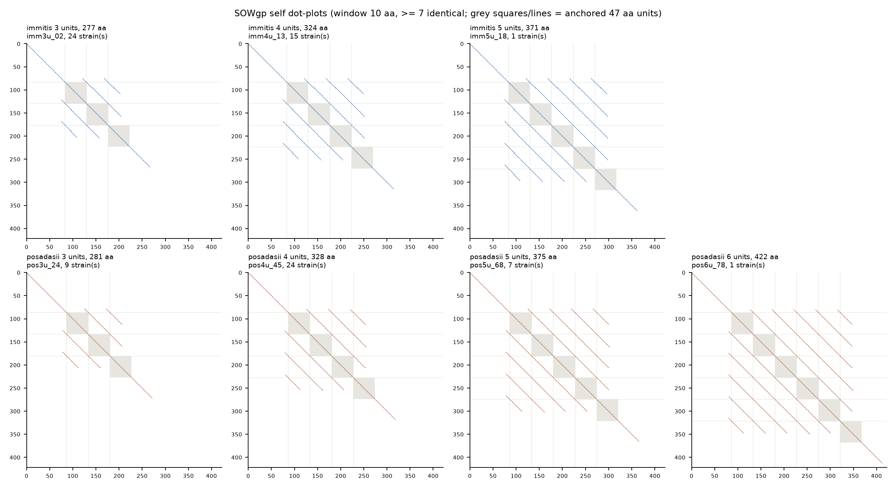
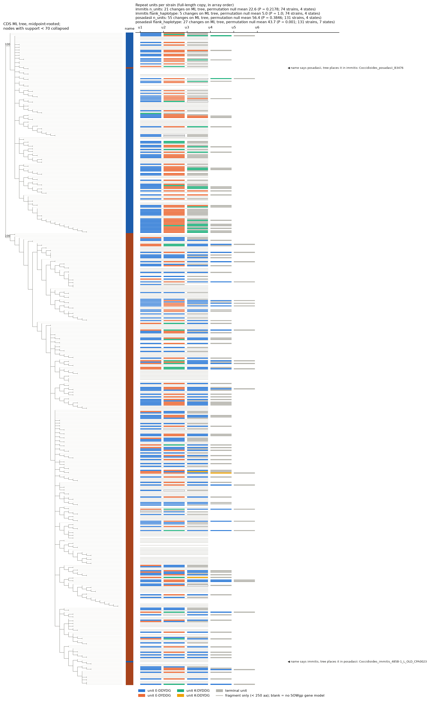

# SOWgp repeat structure: phase-anchored units, length classes, and phylogenetic pattern

**Working report, 2026-09-29.** Scripts 09-13 in `analysis/cocci_repeats/`.
Follows `docs/reports/2026-09-27-cocci-repeat-surface-proteins.md` (section 4.2) and scripts 05-08.

> **Status: computational results only. No experimental validation.** All unit counts come
> from gene models. Most pangenome assemblies are short-read, and short reads can collapse
> repeat arrays. Read section 6 before you use these counts.

---

## 1. Question

How do the SOWgp repeat arrays differ in length and structure across *Coccidioides* strains?
Which unit was gained or lost? Did each length class arise once, or many times?

## 2. Problems found in the first version of `09_sowgp_repeat_viz.py`

| # | Problem | Effect |
|---|---|---|
| 1 | The repeat region was cut into n equal pieces (`region / n`), not at the 47 aa period. | The pieces drifted out of phase: unit 0 started `PPPPKK…`, unit 1 `YGDC…`, unit 2 `DGYC…`. Near-identical units scored 0.53, 0.17 and 0.06 identity to the consensus. Panels (c) and (d) mainly showed this phase shift. |
| 2 | MAFFT only ran if `mafft` was already on `PATH` or `MAFFT_OK` was set. | MAFFT never ran. The figure used the ungapped fallback. The log gave no warning. |
| 3 | The logo drew every letter at the same font size. | Letter height did not show frequency or information content. |
| 4 | `n_copies` is fractional and depends on where the profiler calls the region edges. | The profiler starts the region at aa 98 in *immitis* and aa 81 in *posadasii*. Both base alleles have 3 anchored units, but the histogram showed 2.4 against 2.8. |
| 5 | One row per strain. | 206 rows, but only 79 distinct sequences. One sequence occurs in 24 strains. |

## 3. Method

### 3.1 Unit definition (`sowgp_units.py`)

- **Anchor:** each unit starts at the motif `PTDCYGDC`. Unit length is 47 aa. A unit ends at
  the next anchor or after 47 aa, whichever comes first.
- **Mutated anchor:** if two anchors are 2 periods (±1 aa) apart, one unit is inferred between
  them. This occurred in 2 distinct sequences.
- **Regular spacing:** all anchor spacings are 47 ± 1 aa. 6 distinct sequences (1 strain each)
  are irregular.
- **Unit class:** two diagnostic sites.
  - Offset 8: `E` or `K` (`PTDCYGDC[E/K]DG…`).
  - Offsets 20-33: block `DDYDG` or `DYDDG`.
  - The last unit runs into the C-terminus (`…GSPPPKETK…`). It is classed `terminal`.
- **Unit difference:** mismatches plus gap columns in a global pairwise alignment of two units
  (`unit_diff`).

### 3.2 Alignment for the logo and raster (09)

Each unit is aligned globally to the modal internal unit
`PTDCYGDCEDGYDYSPPPPPKKYGDCDDYDGYCDGPSKTSMKPEPPK` (177 units). The result has 47 columns.
MAFFT `--localpair` was tested and rejected. The terminal units spread that alignment over
72 columns.

### 3.3 Inputs

| Input | Detail |
|---|---|
| `sowgp_repeat_viz.copies.tsv` | 206 full-length copies (≥ 250 aa, no `X`), 205 pangenome + 1 long-read seed. Written by 09. |
| `sowgp_pangenome.tsv` | 489 SOWgp gene models (OG0001318) from 449 strains. 284 are < 250 aa. From 05. |
| Strain tree | IQ-TREE partitioned CDS ML tree, 488 taxa, with support values (`PopGenomics/2025_All_Cocci/Phylogeny/results/msa_filter_cds_ascomycota-buildtree/Cocci_cds.488taxa_ascomycota.fa.part.aicc.contree`). Midpoint-rooted. |

## 4. Results

### 4.1 Length is base length + 47 aa per unit

| Species | Length (aa) | Units | Strains at this length |
|---|---|---|---|
| *immitis* | 277 | 3 | 44 |
| *immitis* | 324 | 4 | 23 |
| *immitis* | 371-373 | 5 | 2 |
| *posadasii* | 281 | 3 | 42 |
| *posadasii* | 328 | 4 | 61 |
| *posadasii* | 375 | 5 | 22 |
| *posadasii* | 422 | 6 | 1 |

- Each step in length is exactly one 47 aa unit.
- The two species' base lengths differ by 4 aa. This difference is outside the repeat array.
- Counts include only strains with a full-length copy. Unit-count totals by species: *immitis*
  2/3/4/5 units = 1/48/23/2; *posadasii* 2/3/4/5/6 = 2/45/62/22/1.
- Figure: [`sowgp_unit_map.png`](sowgp_unit_map.png) panel (b). Table: [`sowgp_unit_map.tsv`](sowgp_unit_map.tsv).

### 4.2 Anchored counts against report section 4.2 and the published alleles

| Sequence | Length | Profiler copies (report §3, §4.2) | Anchored units | Published |
|---|---|---|---|---|
| *C. immitis* RS CIMG_04613 | 324 | 3.4 | **4** | — |
| *C. immitis* CiB10637 / CiB10992 | 371 | 4.4 | **5** | — |
| *C. posadasii* Silveira QVM09276 | 328 | 3.8 | **4** | — |
| SOWgp58 (Q8NK60) | 328 | 3.8 | **4** | 4 copies |
| SOWgp66 (Q8NK61) | 375 | — | **5** | — |
| SOWgp82 (Q96V71) | 422 | 5.8 | **6** | 6 copies |

- Anchored counts are whole numbers and match the published copy numbers for SOWgp58 and
  SOWgp82.
- The profiler's fractional copies are about 0.2-0.6 lower than the anchored counts. Section 4.2
  of the 2026-09-27 report uses the fractional values. That section has not been changed.
- **All three published alleles are *posadasii*-type.** SOWgp58 is identical to Silveira
  QVM09276. SOWgp66 exactly matches 7 *posadasii* pangenome strains. SOWgp82 exactly matches 1.
  All three share their N-terminal flank only with *posadasii* strains. Their lengths fall on
  the *posadasii* series (281 + 47k), not the *immitis* series (277 + 47k). The seed FASTA names
  SOWgp58 and SOWgp66 as "*immitis*", after their UniProt entries.

### 4.3 Unit classes and order ([`sowgp_unit_map.png`](sowgp_unit_map.png) panel a)

- Four internal classes occur: E-DDYDG, E-DYDDG, K-DYDDG, K-DDYDG. K-DDYDG occurs only in
  *posadasii* (4 strains).
- Unit 1 is E-DDYDG in 72 of 74 *immitis* strains and 104 of 127 *posadasii* strains with
  regular spacing. In the other 23 *posadasii* strains, unit 1 is E-DYDDG.
- *immitis* unit 1 has `PPPP` where *posadasii* has `PPPPP`. This is a fixed species
  difference. The figure compares each unit only with
  the modal unit of the same species and class, so this difference is not flagged.
- *posadasii* has more distinct regular sequences than *immitis* at each unit count:
  20 against 12 (3 units), 22 against 5 (4 units), 10 against 2 (5 units). *posadasii* also
  has more strains with a full-length copy (131 against 74).

### 4.4 Identical units inside one allele ([`sowgp_unit_identity.png`](sowgp_unit_identity.png))

Modal (most strains) regular allele for each species and unit count:

| Allele | Strains | Unit classes (in order) | Identical unit pairs (0 aa differences) |
|---|---|---|---|
| *immitis* 3 units | 24 | E-DDYDG, E-DYDDG, term | none |
| *immitis* 4 units | 15 | E-DDYDG, E-DYDDG, K-DYDDG, term | none (units 2-3 differ by 1) |
| *immitis* 5 units | 1 | E-DDYDG, E-DYDDG, K-DYDDG, K-DYDDG, term | units 3 = 4 |
| *posadasii* 3 units | 9 | E-DDYDG, E-DDYDG, term | units 1 = 2 |
| *posadasii* 4 units | 24 | E-DDYDG, E-DYDDG, E-DDYDG, term | none (units 1-3 differ by 1) |
| *posadasii* 5 units | 7 | E-DDYDG, E-DYDDG, E-DDYDG, E-DDYDG, term | units 1 = 3 = 4 |
| *posadasii* 6 units | 1 | E-DDYDG, E-DDYDG, K-DDYDG, E-DYDDG, E-DDYDG, term | units 1 = 2 |

- The terminal unit differs from internal units by 12-16 aa, because its second half is
  C-terminal sequence.
- Identical units fit a recent duplication. They do not show which copy was the source.
  Gene conversion can also make units identical.
- In the modal *posadasii* 3-unit allele, units 1 and 2 are identical. So a comparison of
  longer *posadasii* alleles against it cannot tell which unit was copied.
- Full pairwise table for all 74 regular alleles: [`sowgp_unit_identity.tsv`](sowgp_unit_identity.tsv).

### 4.5 Self dot-plots ([`sowgp_dotplot.png`](sowgp_dotplot.png))

- Window 10 aa, at least 7 identical residues.
- Each extra unit adds one more off-diagonal line at 47 aa spacing.
- The off-diagonal lines start about 8 aa before the first anchor. The sequence just before
  unit 1 (`…PMEPKPPKP`) resembles the end of a unit, so it is probably a partial unit. This
  was seen in the plot only. It was not tested.

### 4.6 Unit count on the strain tree ([`sowgp_tree_units.png`](sowgp_tree_units.png), [`.pdf`](sowgp_tree_units.pdf))

Click the image for the PDF version.

**Strain status (488 tree tips):**

| Status | Strains |
|---|---|
| Full-length copy (≥ 250 aa) | 205 |
| Fragment only (< 250 aa) | 244 |
| No SOWgp gene model | 39 |

One full-length copy (the published SOWgp82) has no tree tip, so it is not plotted.

**Species labels.** The midpoint root splits the tree into a 150-tip clade and a 338-tip clade.
Each clade has one strain whose name gives the other species:

- `Coccidioides_posadasii_B3476` is in the *immitis* clade.
- `Coccidioides_immitis_485B-1_L_OLD_CPA0023` is in the *posadasii* clade.

Neither strain has a full-length SOWgp copy. Scripts 05 and 09 take species from the strain
name. The tree script (13) uses clade membership for its test.

**Parsimony test.** Fitch-Hartigan parsimony on the full ML tree. Strains without a full-length
copy are wildcards. The null is 1000 permutations of the trait among the strains of the same
species.

| Species | Trait | Strains | States | Changes on tree | Null mean | Null 5th pct | P (null ≤ observed) |
|---|---|---|---|---|---|---|---|
| *immitis* | unit count | 74 | 4 | 21 | 22.6 | 20 | 0.22 |
| *immitis* | flank haplotype (control) | 74 | 4 | 5 | 5.0 | 5 | 1.00 |
| *posadasii* | unit count | 131 | 4 | 55 | 56.4 | 52 | 0.38 |
| *posadasii* | flank haplotype (control) | 131 | 7 | 27 | 43.7 | 41 | 0.001 |

- The flank haplotype is the protein sequence outside the repeat array. It is the control. If
  the flank groups on the tree, the tree resolves this locus.
- **In *posadasii*, the flank groups on the tree but unit count does not.** Each common flank
  haplotype carries 3, 4 and 5 units.
- This fits unit count changing many times independently.
- Two other explanations are not excluded:
  1. Unit counts from short-read gene models are wrong for some strains, and the errors look
     random on the tree.
  2. The within-species tree has short branches and low support.
- In *immitis*, one flank haplotype holds 69 of 74 strains. The control has no power there, so
  the *immitis* unit-count result cannot be interpreted.

## 5. The three long-read strains with no SOWgp call (scripts 07-08)

This summarizes existing outputs. No new runs were made for this section.

- tblastn (SEG on, script 07): 29 hits in VFC140, 22 in Cpos1038, 58 in Cpos3700.
- tblastn without SEG (`sowgp_tblastn_noseg_*.out`) was run by hand. The command is not
  recorded.
- In all three strains, SEG-off hits to the RS query cover aa 1-324 on scaffold_2. Cpos3700
  also has repeat hits on scaffold_84. So a SOWgp locus is present in all three assemblies.
- 08 extracted 130 ORFs (≥ 50 aa, 6 frames) from the loci. A DIAMOND search of those ORFs
  (`sowgp_loci_orfs_diamond.tsv`, run by hand) found only short matches:
  - At the SOWgp locus of each strain, one ORF matches SOWgp aa 1-36 at 100% identity.
  - At a second locus in each strain (VFC140 and Cpos1038 scaffold_1; Cpos3700 scaffold_5 and
    scaffold_31), one ORF matches aa 20-65 of the Silveira fragment QVM10648.1 (OG0007110) at
    96-100% identity.
  - No ORF covers the repeat array. This fits a gene model broken by an intron or frame change.
- Distinct subject positions of hits to one internal unit (RS aa 114-160):

  | Strain | Positions | Spacing |
  |---|---|---|
  | VFC140 | 2 (scaffold_2) | — |
  | Cpos1038 | 5 (scaffold_2) | 188-197 nt |
  | Cpos3700 | 5 (scaffold_2) + 5 (scaffold_84) | 188-197 nt (scaffold_2) |

  One 47 aa unit is 141 nt. A spacing of 188-197 nt means each repeat on the genome is
  47-56 nt longer than one unit. This could be an intron in each unit. It has not been checked.
  Cpos3700 may carry two array copies (scaffold_2 and scaffold_84). This has not been checked.
- The absence reported in section 4.2 of the 2026-09-27 report is therefore probably a
  gene-model failure, not a missing locus. Unit counts at these loci still need a manual gene
  model or long-read transcript evidence.

## 6. Limits

1. Unit counts come from gene models. The 496-genome pangenome is mostly short-read
   assemblies, so collapsed arrays give counts that are too low. The counts were not checked
   against read depth.
2. 244 strains have only fragments, and 39 have no SOWgp gene model. The tree test uses only
   the 205 strains with a full-length copy. These may not be a random sample.
3. The unit classes use two sites only. Other point differences are shown in the figures but
   are not used for classes.
4. The strain tree is a CDS concatenation tree. It is not a SNP tree. Within-species branch
   lengths are near zero, and many nodes have low support. The display collapses nodes with
   support < 70. The test uses the full tree.
5. The parsimony test treats unit count as unordered. It does not model the stepwise gain or
   loss of one unit at a time.

## 7. Next steps

1. Measure read depth across the SOWgp array in the short-read strains, to find collapsed
   arrays.
2. Build manual gene models at the VFC140, Cpos1038 and Cpos3700 loci. Check the 188-197 nt
   repeat spacing for introns.
3. Repeat the tree test with a SNP tree, if one exists for these strains.
4. Check the two strains whose name and clade disagree (`posadasii_B3476`,
   `immitis_485B-1_L_OLD_CPA0023`).
5. Update section 4.2 of the 2026-09-27 report to anchored unit counts.

## 8. Files

| File | Contents |
|---|---|
| `sowgp_units.py` | Shared code: anchors, unit classes, distinct alleles, unit differences, colours |
| `09_sowgp_repeat_viz.py` | [`sowgp_repeat_viz.png`](sowgp_repeat_viz.png), `.copies.tsv`, `.units.tsv` |
| `10_sowgp_unit_map.py` | [`sowgp_unit_map.png`](sowgp_unit_map.png), `.tsv` |
| `11_sowgp_unit_identity.py` | [`sowgp_unit_identity.png`](sowgp_unit_identity.png), `.tsv` |
| `12_sowgp_dotplot.py` | [`sowgp_dotplot.png`](sowgp_dotplot.png) |
| `13_sowgp_tree_units.py` | [`sowgp_tree_units.png`](sowgp_tree_units.png), [`.pdf`](sowgp_tree_units.pdf), `.tsv`, `.stats.tsv` |

Run order: 09, then 10-13 in any order. Each runs in seconds with `/usr/bin/python3.12`.
13 takes about 15 s with 1000 permutations.

## 9. Sources

- Hung CY, Yu JJ, Seshan KR, Reichard U, Cole GT. 2002. *Infect Immun* 70:3443-56.
  https://doi.org/10.1128/IAI.70.7.3443-3456.2002. SOWgp repeats and size alleles.
- Fitch WM. 1971. Toward defining the course of evolution: minimum change for a specific tree
  topology. *Syst Zool* 20:406-416. https://doi.org/10.2307/2412116
- Hartigan JA. 1973. Minimum mutation fits to a given tree. *Biometrics* 29:53-65.
  https://doi.org/10.2307/2529676

---

## Correction, 2026-09-30: the three "no protein call" strains do have SOWgp models

Section 5 of this report, and section 3 of `README.md`, state that a SOWgp locus is present in
VFC140, Cpos1038 and Cpos3700 **with no protein call**, and infer a gene-model failure. The
first half of that is wrong. **All three strains have SOWgp protein models in their own
proteomes.** They were missed because the search went through the pangenome orthogroups, and
because `02_repeat_profile.py` does not call them.

Found by searching all seven proteomes directly for the `PTDCYGDC` anchor:

| strain | protein | len | anchors | maps to SOWgp58 | identity |
|---|---|---|---|---|---|
| VFC140 | `VFC140_004201-T1` | 234 | 2 | **aa 1-328 (whole)** | **99.6%** |
| Cpos1038 | `CPOS1038_003233-T1` | 164 | 2 | aa 1-164 | 96.3% |
| Cpos1038 | `CPOS1038_003234-T1` | 202 | 3 | aa 127-328 | 99.0% |
| Cpos3700 | `CPOS3700_003933-T1` | 202 | 3 | aa 127-328 | 98.0% |
| Cpos3700 | `CPOS3700_010247-T1` | 115 | 1 | aa 1-117 | 98.2% |
| Cpos3700 | `CPOS3700_010248-T1` | 108 | 1 | aa 221-328 | 99.1% |

Three separate conclusions, and they are not the same:

1. **VFC140 is not a gene-model failure.** It has one model, 234 aa, matching the whole of
   SOWgp58 at 99.6% identity, with 2 anchored units in regular spacing.

   *Correction to a first draft of this addendum:* 2-unit alleles are **not** new. The
   pangenome already contains them — *immitis* 250 aa and *posadasii* 251 / 255 aa, one strain
   each. Section 4's "277 / 324 / 371 = 3 / 4 / 5 units" is the **modal** series, not the full
   range. What is different about VFC140 is its *quality*, not its unit count: it is 99.6%
   identical to SOWgp58 across its whole length, whereas the existing 250 aa *immitis* 2-unit
   call has a completely divergent N-terminus (93 mismatched columns in a global alignment,
   starting at residue 1) and looks like a gene-model artifact rather than a short allele.
   **VFC140_004201-T1 may be the first clean 2-unit allele in this dataset. That is a
   hypothesis from one alignment, not an established result.**

   Its implied base length is **140 aa**, not the modal *immitis* 136. The difference is in
   the N-terminal non-repeat region: VFC140 carries `GATSHKEHSYCDTYGCDGP` where the modal
   277 aa allele has `GAKEHSYCDTYGCDGP`. So section 4's `length = base + 47 x units` holds
   within a modal allele series but **base length is not a species constant** — observed bases
   run 116-156 in *immitis* and 120-161 in *posadasii*.
2. **Cpos1038 is a split gene model, and the split is now visible.** Two consecutive locus
   tags cover aa 1-164 and aa 127-328 — **overlapping halves of one protein**. This is the
   gene-model failure the original section 5 predicted, but it produces two short calls, not
   zero calls.
3. **Cpos3700 has two separate SOWgp regions**, one called as a single 202 aa model
   (aa 127-328) and another split across `010247` + `010248` (aa 1-117 and aa 221-328).
   Whether that is two loci or one locus split across contigs is **not established here**.

### Why this was missed

- `05_sowgp_pangenome.py` takes SOWgp members from the 496-genome pangenome orthogroups. The
  five UArizona long-read proteomes are a different dataset and were only ever profiled by
  `02_repeat_profile.py`, never searched for the anchor directly.
- `02_repeat_profile.py` does not call `VFC140_004201-T1`. Its units are **not** diverged
  (99.6% identity), so this is not the divergence floor. With only 2-3 copies in 234 aa it
  falls below 02's `copies >= 2.5` threshold. `14_repeat_detect_general.py` calls it at 3
  copies, which is why it appears among the 22 newly secreted candidates
  (`REPORT_2026-09-29_repeat_detector_divergence.md`, section 5).

### What this does not change

The tblastn work in section 5 stands: the loci are real and are where the report said. What
changes is the claim that no protein was called from them. Counts elsewhere in this report are
drawn from the pangenome set and are unaffected; the unit-count range for *immitis* (item 1
above) is the one number that may need revising, and that needs the VFC140 allele placed on the
tree before anything is claimed.

**Not experimentally validated.** Every statement here is from sequence alignment.

Reproduce: search each proteome for `PTDCYGDC`, then align hits to `sowgp_seed.fa` with a local
BLOSUM62 alignment. Both steps are inline in the 2026-09-30 session, not yet scripted.
