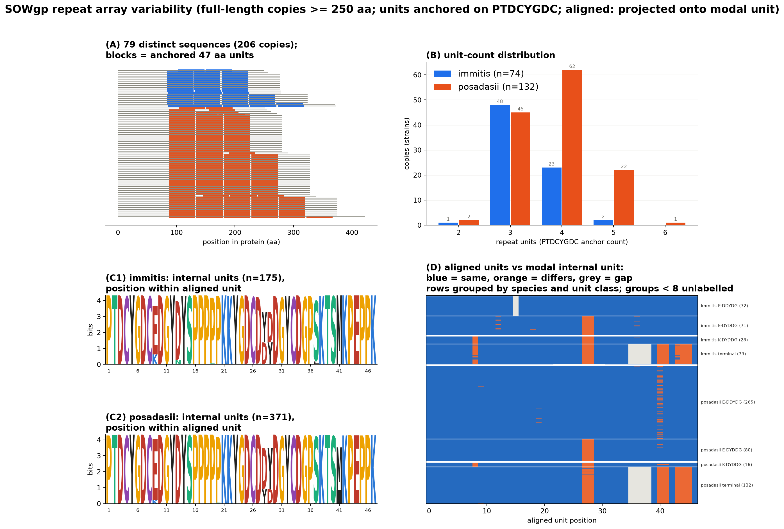
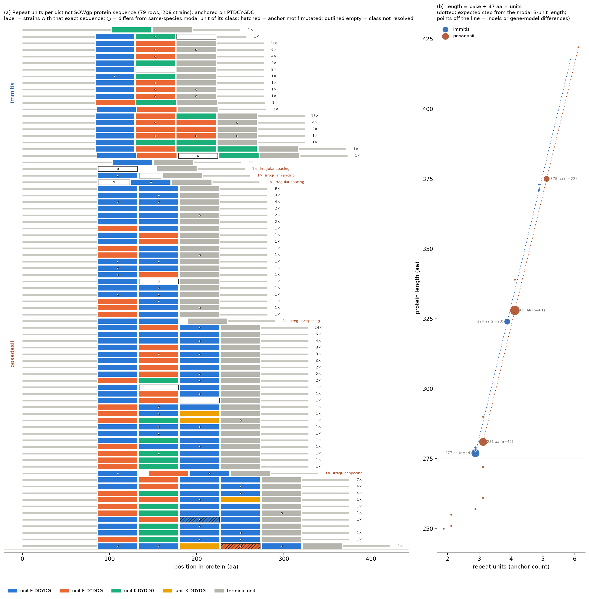
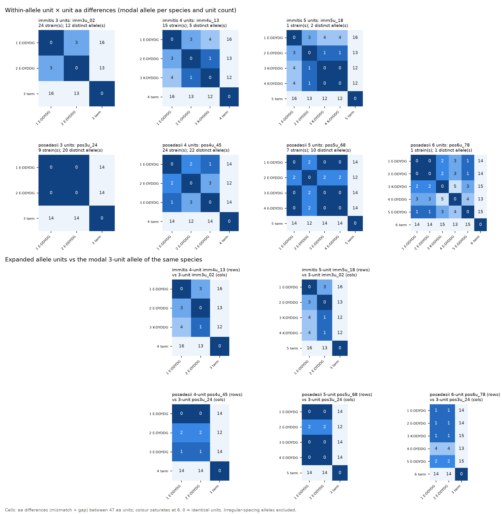
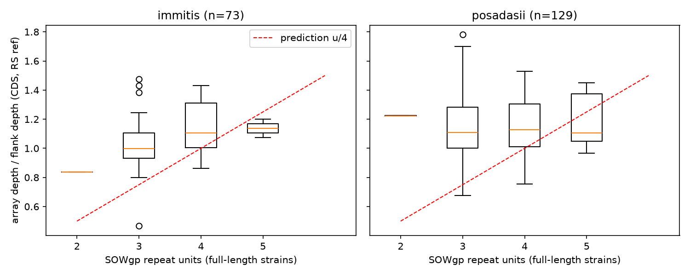

# Figures and tables in `analysis/cocci_repeats/`

Date: 2026-10-04. Status: computational results only. No experimental validation.

This is an index of every figure and the main tables in this folder, with what each shows. The
numbers are copied from the three detailed reports; follow the links there for method and limits.

| Report | Covers |
|---|---|
| [`REPORT_2026-09-29_sowgp_repeat_structure.md`](REPORT_2026-09-29_sowgp_repeat_structure.md) | Figures 1-5, tables T6-T9 |
| [`REPORT_2026-09-29_repeat_detector_divergence.md`](REPORT_2026-09-29_repeat_detector_divergence.md) | Figure 6, tables T10-T11 |
| [`REPORT_2026-10-01_sowgp_depth_vs_repeats.md`](REPORT_2026-10-01_sowgp_depth_vs_repeats.md) | Figure 7, tables T12-T13 |
| [`docs/reports/2026-09-27-cocci-repeat-surface-proteins.md`](../../docs/reports/2026-09-27-cocci-repeat-surface-proteins.md) | Tables T1-T5 |
| [`README.md`](README.md) | Script order and file provenance |

All figures are in [`plots/`](plots/). Each is shown as a PNG here; the PDF link beside it is the
vector version.

**Not regenerable here.** Figures 5 (`13_sowgp_tree_units.py`) and 7 (`40_sowgp_array_depth.py`)
read files under `/bigdata` (the strain tree and mosdepth region files) that are not on every
machine. The other five figures regenerate from files in this folder (Figure 6 after
decompressing its `.gz` inputs).

---

## Figures

### Figure 1. SOWgp repeat array variability

[PDF](plots/sowgp_repeat_viz.pdf) · script `09_sowgp_repeat_viz.py`

Four panels for the 206 strains with a full-length SOWgp copy (≥ 250 aa), repeat units anchored
on `PTDCYGDC`.

- **(A)** One row per distinct sequence (79), units drawn as filled blocks (blue *immitis*,
  orange *posadasii*) on a grey backbone. Arrays of 3 to 6 units sit on a shared left flank.
- **(B)** Number of strains by unit count and species. *immitis* 2/3/4/5 units = 1/48/23/2;
  *posadasii* 2/3/4/5/6 = 2/45/62/22/1. Modal count is 3 in *immitis* and 4 in *posadasii*.
- **(C1, C2)** Information-content logos of the internal 47 aa units, one per species. The unit
  is highly conserved; the variable columns are the ones that define the unit classes.
- **(D)** Raster of every aligned unit against the modal internal unit. Blue = same, orange =
  differs, grey = gap. Rows are grouped by species and unit class. The terminal unit differs
  from internal units over its second half.

### Figure 2. Unit map

[PDF](plots/sowgp_unit_map.pdf) · script `10_sowgp_unit_map.py` · table T6

One row per distinct sequence, with each unit coloured by class. Panel (a) shows unit classes
and their order; panel (b) shows protein length against unit count. Length is a base length plus
47 aa per unit: *immitis* 277, 324, 371-373 aa (3, 4, 5 units); *posadasii* 281, 328, 375, 422 aa
(3, 4, 5, 6 units). The two species' base lengths differ by 4 aa, outside the array. Four
internal classes occur (E-DDYDG, E-DYDDG, K-DYDDG, K-DDYDG); K-DDYDG is found only in 4
*posadasii* strains.

### Figure 3. Unit identity inside alleles

[PDF](plots/sowgp_unit_identity.pdf) · script `11_sowgp_unit_identity.py` · table T7

Top: unit-by-unit amino-acid differences within the modal allele of each species and unit count.
Bottom: longer alleles compared with the 3-unit allele. Identical unit pairs (0 aa differences)
occur in some alleles, for example units 1 = 2 in the *posadasii* 3-unit allele. The terminal
unit differs from internal units by 12-16 aa. Identical units fit a recent duplication, but
gene conversion can also produce them, and the figure cannot say which copy was the source.

### Figure 4. Self dot-plots

[PDF](plots/sowgp_dotplot.pdf) · script `12_sowgp_dotplot.py`

Seven panels: one representative sequence per species and unit count (window 10 aa, at least 7
identical residues). Each extra unit adds one off-diagonal line at 47 aa spacing. The
off-diagonals start about 8 aa before the first anchor, which suggests a partial unit upstream.
That was seen in the plot only; it was not tested.

### Figure 5. Unit count on the strain tree

[PDF](plots/sowgp_tree_units.pdf) · script `13_sowgp_tree_units.py` · tables T8-T9

Cladogram of the 488-strain CDS maximum-likelihood tree (nodes with support < 70 collapsed),
annotated with each strain's SOWgp status and unit count. Of 488 tips, 205 have a full-length
copy, 244 a fragment only, and 39 no SOWgp gene model. The parsimony test asks whether unit
count is clustered on the tree. In *posadasii* the flank haplotype is clustered (control,
P = 0.001) but unit count is not (55 changes against a null mean of 56.4, P = 0.38), which fits
unit count changing many times independently. In *immitis* one flank haplotype holds 69 of 74
strains, so the control has no power and the unit-count result cannot be interpreted.

### Figure 6. Repeat-detector benchmark

[PDF](plots/repeat_benchmark.pdf) · script `16_repeat_benchmark_eval.py` · tables T10-T11

Recall of three detector arms (old `02`, new with exact matching, new with similarity matching)
on synthetic repeat arrays, against unit-to-unit identity, plus the controls. The old detector
reaches 50% recall at about 75% unit identity; the new one at about 35%. Neither new arm
reaches 90% recall anywhere (plateau 87-94%), and above about 85% identity the old detector has
the higher recall. Neither arm calls any of the 800 non-repeat controls. These are synthetic
arrays under an assumed mutation model.

### Figure 7. Array depth against unit count

[PNG only, no PDF yet](plots/sowgp_array_depth.png) · script `40_sowgp_array_depth.py` · table T12

Read depth over the SOWgp repeat array divided by flank depth, by unit count, for each species
(boxplots, 202 full-length strains with ≥ 10x genome depth). The red dashed line is the
prediction written before the data were seen: ratio = units / 4. **The prediction does not
hold.** The slope per unit is 0.110 (95% CI 0.040 to 0.181) in *immitis* and 0.016 (-0.032 to
0.063) in *posadasii*, against a predicted 0.25. Array depth is about equal to flank depth at
every unit count. This figure has no PDF because the script needs the `/bigdata` mosdepth files.

---

## Tables

Row counts are data rows, from the files in this folder. Large files are tracked as `.gz` only
(see README, "In git").

### Part A: class-2a candidates (scripts 01-04)

| ID | File | Rows | What it holds |
|---|---|---|---|
| T1 | [`signalp_summary.tsv`](signalp_summary.tsv) | 7 | Per proteome: proteins profiled, proteins with a signal peptide, fraction |
| T2 | `repeat_profile_reference.tsv.gz`, `repeat_profile_longread.tsv.gz` | 18,014 and 53,030 | Tandem-repeat profile of every protein (period, copies, coverage, unit, composition). 71,044 proteins in all |
| T3 | [`class2a_candidates.tsv`](class2a_candidates.tsv) | 41 | Secreted proteins with a tandem repeat (coverage ≥ 0.25, ≥ 2.5 copies): 20 Pro/Cys-rich, 10 Ser/Thr-rich, 11 other |
| T4 | [`procys_rs_map.tsv`](procys_rs_map.tsv) | 20 | The Pro/Cys-rich candidates mapped to *C. immitis* RS proteins (DIAMOND) |
| T5 | [`procys_rs_tpm.tsv`](procys_rs_tpm.tsv) | 5 | Spherule and mycelium TPM for the mapped RS proteins. Only SOWgp (`CIMG_04613`) is spherule-induced: about 15,000 TPM at 48 h against about 13 TPM in mycelium |

### Part B and C: SOWgp across the pangenome

| ID | File | Rows | What it holds |
|---|---|---|---|
| T6 | `sowgp_unit_map.tsv.gz` | 79 | One row per distinct sequence: species, length, strain count, unit count, class string, unit start positions (feeds Figure 2) |
| T7 | `sowgp_unit_identity.tsv.gz` | 395 | Pairwise unit differences for the 74 regular alleles (feeds Figure 3) |
| T8 | [`sowgp_tree_units.tsv`](sowgp_tree_units.tsv) | 488 | Per tree tip: species, status, unit count, classes, flank haplotype (feeds Figure 5) |
| T9 | [`sowgp_tree_units.stats.tsv`](sowgp_tree_units.stats.tsv) | 4 | Parsimony changes and permutation null for unit count and flank haplotype, by species |

The inputs to Figures 1-5 are [`sowgp_pangenome.tsv`](sowgp_pangenome.tsv) (952 gene models in
the SOWgp orthogroups), [`sowgp_pangenome_summary.tsv`](sowgp_pangenome_summary.tsv) (one row
per strain, 484), [`sowgp_repeat_viz.copies.tsv`](sowgp_repeat_viz.copies.tsv) (206
full-length copies) and [`sowgp_repeat_viz.units.tsv`](sowgp_repeat_viz.units.tsv) (750 units).
[`longread_locus_summary.tsv`](longread_locus_summary.tsv) (5 strains) and
[`sowgp_anchored_longread.tsv`](sowgp_anchored_longread.tsv) (9 rows) hold the long-read locus
calls; the correction in the structure report explains why three strains with "no protein call"
do have SOWgp models.

### Part D: detector divergence and family search

| ID | File | Rows | What it holds |
|---|---|---|---|
| T10 | [`repeat_benchmark_metrics.tsv`](repeat_benchmark_metrics.tsv) | 71 | Recall, copy-number error and false-positive metrics per arm (feeds Figure 6). Headline: 50% recall at about 75% identity (old) and about 35% (new); false positives 0 and 0 on 800 controls |
| T11 | [`repeat_real_compare.tsv`](repeat_real_compare.tsv) | 205 | Old against new detector on real proteins. Real SOWgp alleles detected: 62 of 74 (old), 74 of 74 (new) |
| — | `repeat_benchmark_calls.tsv.gz`, `repeat_benchmark_truth.tsv.gz` | — | Per-sequence calls and ground truth behind T10 |
| — | [`pfam_confirmation.tsv`](pfam_confirmation.tsv) | 1,435 | Pfam cross-check of repeat calls; see [`REPORT_2026-09-30_pfam_confirmation.md`](REPORT_2026-09-30_pfam_confirmation.md) |
| — | [`pfam_repeat_families.tsv`](pfam_repeat_families.tsv), [`pfam_period_check.tsv`](pfam_period_check.tsv) | 26 and 193 | Repeat-type Pfam families and their spacing against the detected period |
| — | [`sowgp_anchor_motifs.tsv`](sowgp_anchor_motifs.tsv) | 24 | Candidate anchor motifs with conservation against a null; see [`REPORT_2026-09-30_anchored_family_search.md`](REPORT_2026-09-30_anchored_family_search.md) |

### Read depth

| ID | File | Rows | What it holds |
|---|---|---|---|
| T12 | [`sowgp_array_depth.tsv`](sowgp_array_depth.tsv) | 558 | Per strain: array and flank depth, Q20 depth, array/flank ratio, unit count, clade (feeds Figure 7) |
| T13 | [`CIMG_04613.coverage.tsv`](CIMG_04613.coverage.tsv) | 558 | Whole-gene depth and genome-wide depth per strain. Whole-gene depth against unit count: rho = +0.18 (both species), +0.30 (*immitis*, n = 73), +0.04 (*posadasii*, n = 129) |

Array depth against unit count (Spearman, MAPQ-unfiltered): *immitis* rho = +0.37, p = 0.0012;
*posadasii* rho = +0.07, p = 0.46.

---

## What these figures do and do not show

- Unit count varies from 2 to 6, in steps of exactly 47 aa, and this is stable across 206
  strains. The **tree** (Figure 5) does not show unit count tracking ancestry in *posadasii*.
- The **depth** result (Figure 7) does not support a simple "more units, more reads" model, so
  it is no independent evidence for the unit counts. It does not show the counts are wrong
  either; the depth report lists the limits.
- The **benchmark** (Figure 6) is synthetic. The 75% and 35% floors depend on the assumed
  mutation model.
- Nothing here is experimentally validated.
