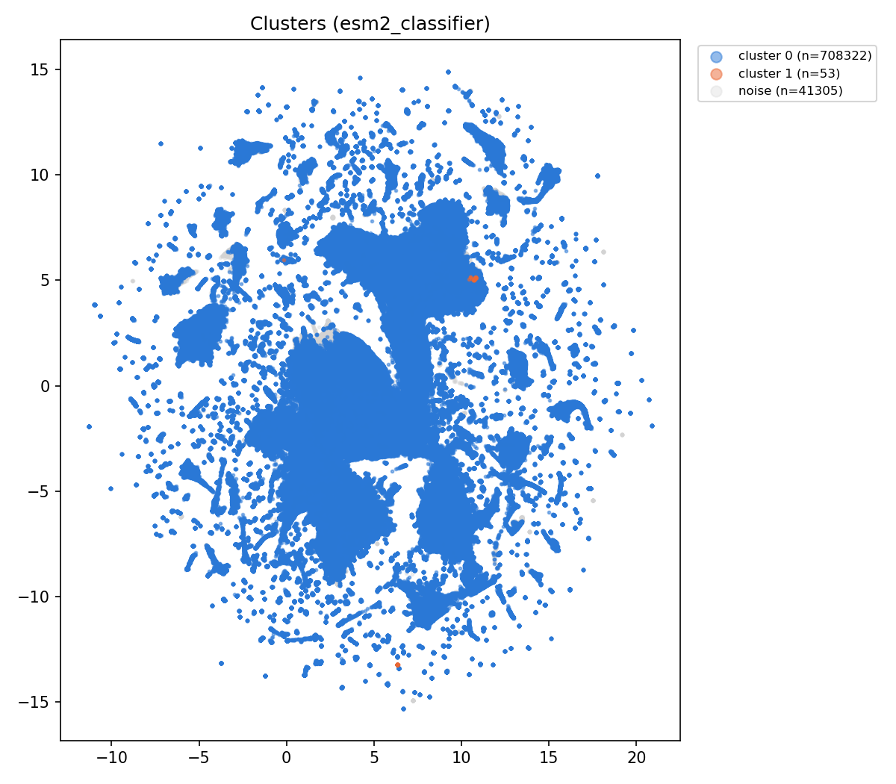
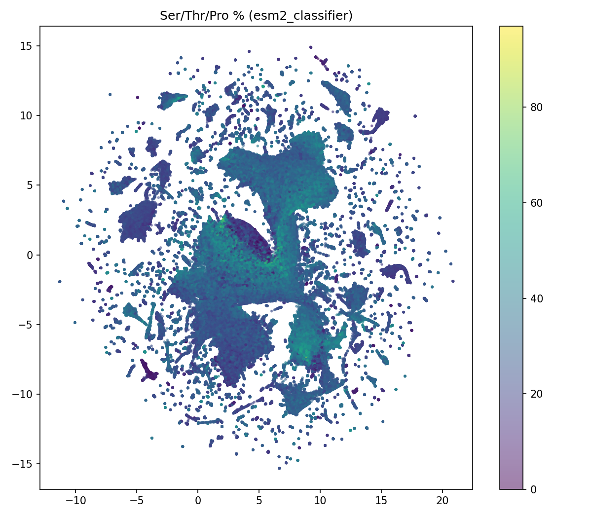
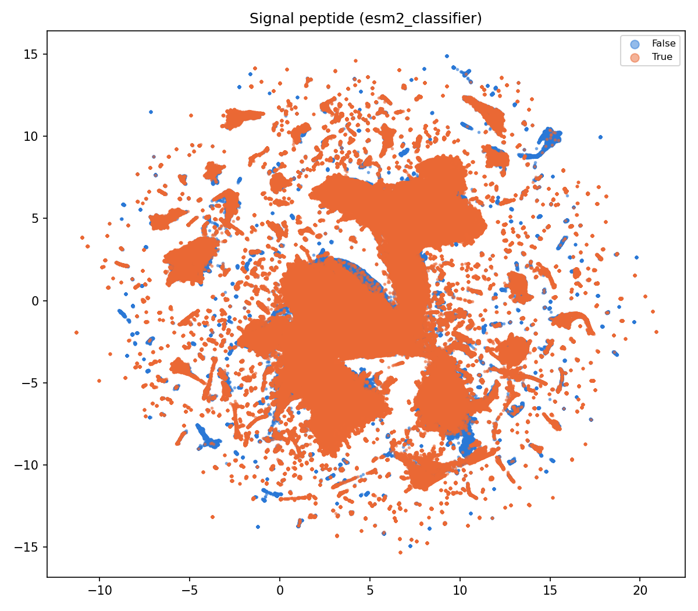
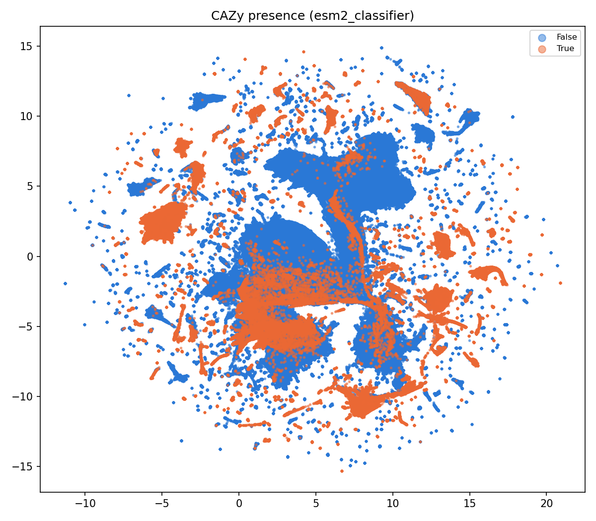
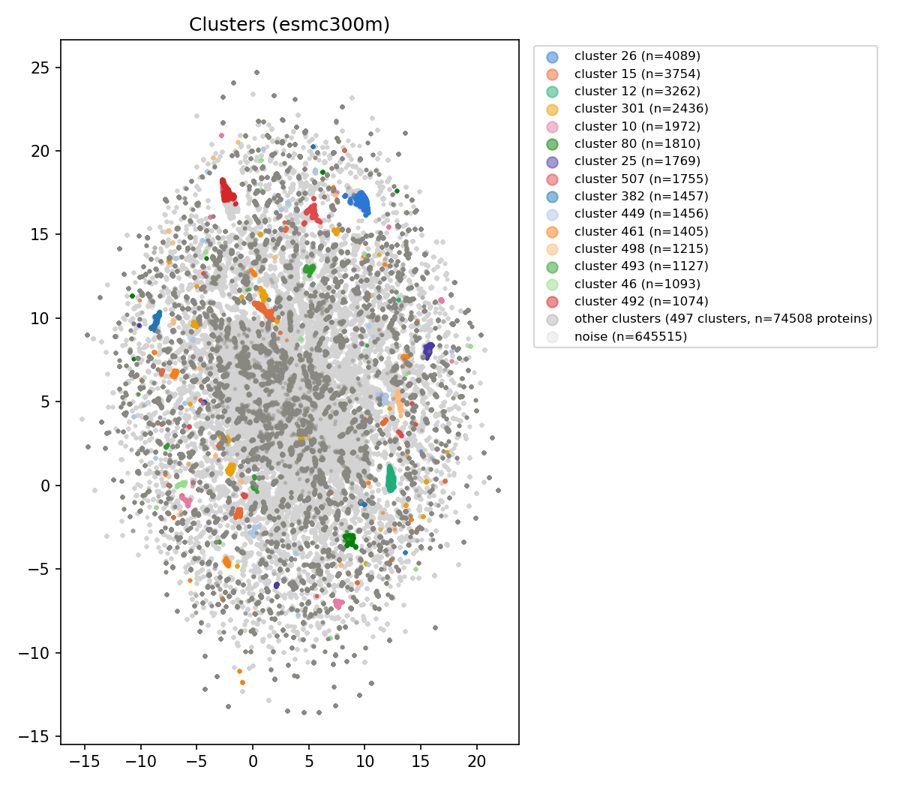
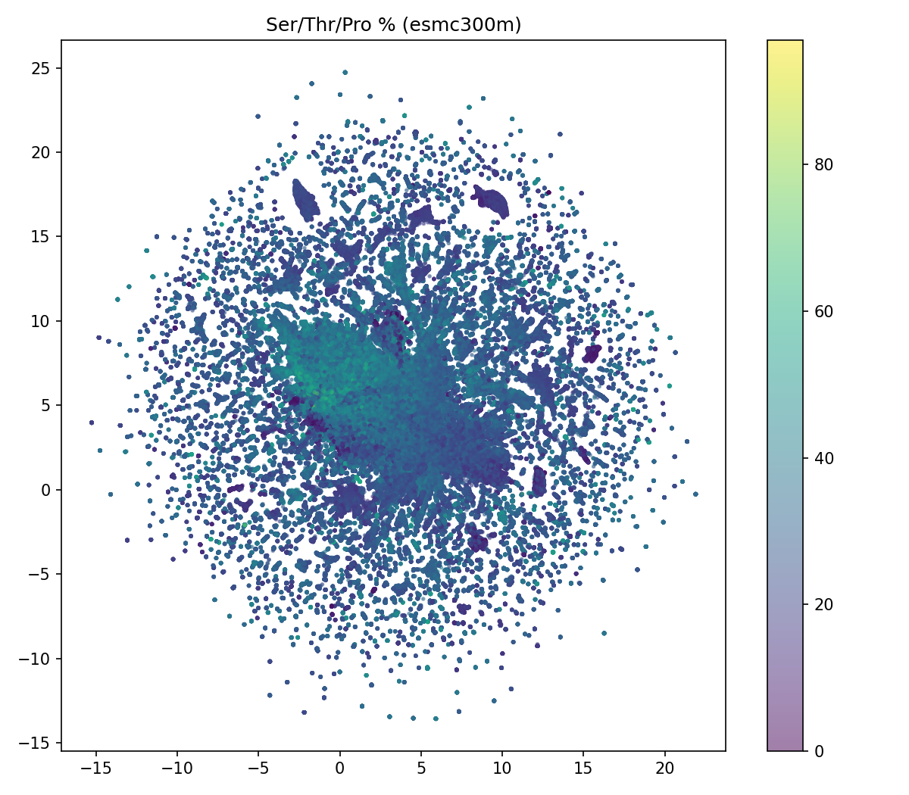
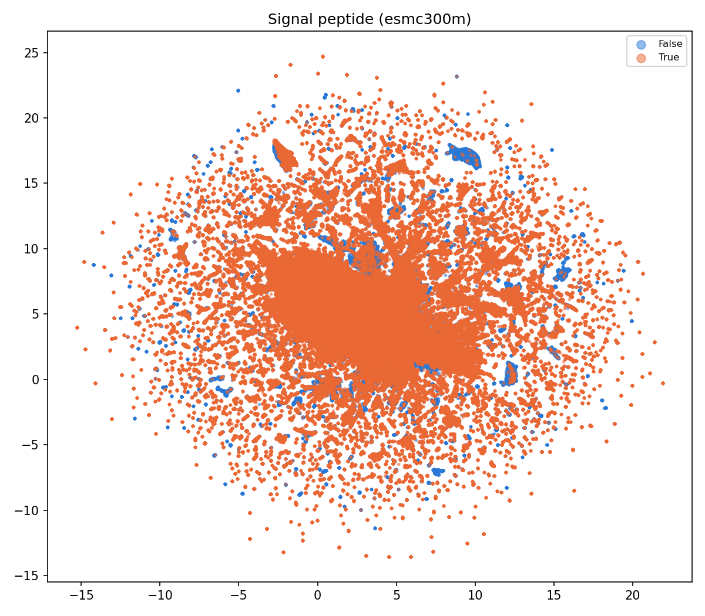
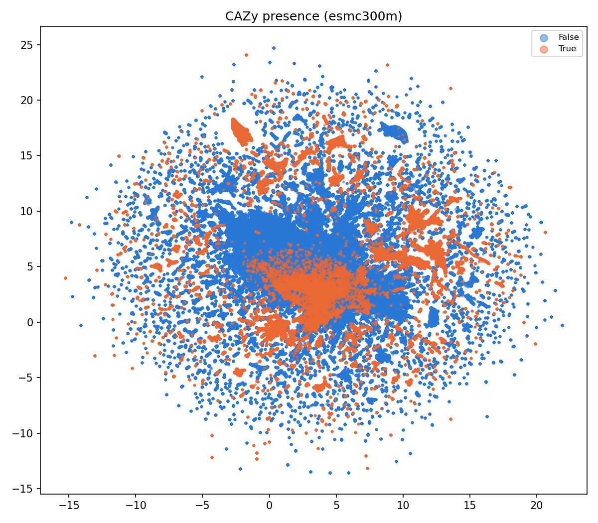

# Embedding-Space Clustering of Fungal Adhesion Proteins

## Scope

- **ESM2-classifier**: 749680 proteins embedded, 2 clusters found, 41305 noise points (5.5% of the set).
- **ESM-C 300M**: 749697 proteins embedded, 512 clusters found, 645515 noise points (86.1% of the set).

Both cluster summaries are computed by `05_validate_and_compare.py` from
`tables/cluster_labels_{space}.csv` (per-protein cluster assignment, produced
by Tasks 3/4/6's real ESM2-classifier-space and ESM-C 300M embedding
extraction + `sklearn.cluster.HDBSCAN` clustering), joined against
`analysis/adhesion_properties/tables/{protein_sequence_properties,protein_domain_flags}.csv`.

**Why the two spaces cover slightly different protein counts (749,680 vs.
749,697):** the shipped classifier's own embedding function
(`src/adhesion_predict/embeddings.py`'s `get_esm_embeddings`) silently
drops an entire batch of sequences if any single sequence in it fails to
tokenize. The real ESM2-classifier extraction run lost 176 proteins to
this; 159 were pure batch-collateral-damage and were recovered by
re-running them in isolation (`analysis/embedding_clustering/recover_missing_esm2_embeddings.py`,
committed alongside this report) at `batch_size=1`, same model, same
mathematical result. The remaining 17 genuinely contain `J` or `*`
characters that are not in ESM-2's tokenizer alphabet at all -- these
cannot be embedded in ESM2-classifier space by any batching choice, a
real and permanent limitation of that embedding space (not a bug). ESM-C
300M's tokenizer handles a broader character set and embedded all
749,697 proteins with zero missing. `get_esm_embeddings` itself is
deliberately left unmodified, as it is pre-existing production code for
the shipped classifier, out of scope for this analysis to alter.

## Per-space cluster summary

Each cluster's N, median length, median Ser/Thr/Pro%, mean hydrophobicity,
and domain-flag fractions (`has_pfam`, `has_cazy`, `has_merops`,
`has_signal_peptide`, `has_tm_helix`). Cluster label `-1` is HDBSCAN noise
(not dropped -- reported like any other cluster, per this project's stated
caveat that noise is a real category, not an artifact to hide).

### ESM2-classifier

| cluster_label | n | median_length | median_pct_ser_thr_pro | mean_hydrophobicity | has_pfam | has_cazy | has_merops | has_signal_peptide | has_tm_helix |
| --- | --- | --- | --- | --- | --- | --- | --- | --- | --- |
| 0 | 708322 | 352.0000 | 29.4872 | -0.1617 | 0.4120 | 0.2074 | 0.0062 | 0.7241 | 0.1162 |
| -1 | 41305 | 162.0000 | 27.7228 | -0.2429 | 0.2161 | 0.0509 | 0.0021 | 0.4071 | 0.1111 |
| 1 | 53 | 169.0000 | 44.3787 | -0.6686 | 0.0000 | 0.0000 | 0.0000 | 0.9245 | 0.0377 |

### ESM-C 300M

| cluster_label | n | median_length | median_pct_ser_thr_pro | mean_hydrophobicity | has_pfam | has_cazy | has_merops | has_signal_peptide | has_tm_helix |
| --- | --- | --- | --- | --- | --- | --- | --- | --- | --- |
| -1 | 645515 | 329.0000 | 29.9611 | -0.1513 | 0.3962 | 0.1918 | 0.0062 | 0.7013 | 0.1163 |
| 26 | 4089 | 1397.0000 | 17.7215 | -0.3224 | 0.8222 | 0.0000 | 0.0002 | 0.0020 | 0.0186 |
| 15 | 3754 | 1835.5000 | 27.1685 | -0.8348 | 0.0506 | 0.0008 | 0.0000 | 0.0021 | 0.0485 |
| 12 | 3262 | 399.0000 | 17.2353 | 0.1902 | 0.0018 | 0.0000 | 0.0000 | 0.0083 | 0.0825 |
| 301 | 2436 | 283.0000 | 33.5548 | -0.0682 | 0.1285 | 0.0004 | 0.0000 | 0.9741 | 0.0016 |
| 10 | 1972 | 1196.0000 | 16.7096 | -0.8707 | 0.0355 | 0.0000 | 0.0005 | 0.0000 | 0.0041 |
| 80 | 1810 | 211.5000 | 16.4703 | -0.8193 | 0.0680 | 0.0000 | 0.0000 | 0.9674 | 0.0796 |
| 25 | 1769 | 905.0000 | 7.9498 | -0.6934 | 1.0000 | 0.0000 | 0.0000 | 0.0011 | 0.0090 |
| 507 | 1755 | 622.0000 | 18.2796 | -0.2090 | 1.0000 | 1.0000 | 0.0000 | 0.9772 | 0.9567 |
| 382 | 1457 | 369.0000 | 26.8908 | -0.0838 | 0.0000 | 0.0000 | 0.0000 | 0.9327 | 0.4839 |
| 449 | 1456 | 411.0000 | 29.2473 | -0.2817 | 0.1332 | 1.0000 | 0.0000 | 0.9842 | 0.0172 |
| 461 | 1405 | 418.0000 | 27.9070 | -0.2949 | 1.0000 | 1.0000 | 0.0000 | 0.9843 | 0.0007 |
| 498 | 1215 | 565.0000 | 23.2394 | -0.2421 | 1.0000 | 1.0000 | 0.0000 | 0.9267 | 0.0066 |
| 493 | 1127 | 687.0000 | 18.8679 | -0.4107 | 1.0000 | 1.0000 | 0.0000 | 0.0000 | 0.9681 |
| 46 | 1093 | 1456.0000 | 13.2670 | -0.6997 | 1.0000 | 0.0000 | 0.0000 | 0.0000 | 0.4593 |

(showing top 15 of 513 rows, sorted by n; full table in `tables/cluster_summary_esmc300m.csv`)

## Agreement between the two embedding spaces (contingency table)

Full cross-tabulation is in `tables/cluster_contingency_table.csv`
(3 ESM2-classifier rows x 513 ESM-C 300M columns -- too wide to render
usefully here as a table, so it is summarized below instead):

Shape: 3 ESM2-classifier cluster labels (rows, including noise) x 513 ESM-C 300M cluster labels (columns, including noise), covering 749680 proteins with cluster assignments in both spaces.
- ESM2-classifier's dominant cluster (label 0, n=708322) spreads across 511 of 512 real ESM-C clusters: 606045 (85.6%) land in ESM-C noise, and the largest single non-noise cell is only 4082 proteins (0.58% of the cluster) -- ESM-C's fine clustering resolves internal structure that ESM2-classifier space cannot distinguish.
- ESM2-classifier's noise row (n=41305) concentrates heavily in ESM-C noise too (39449/41305 = 95.5%) -- the two spaces largely agree on which proteins don't fit any cluster.
- ESM2-classifier's tiny second cluster (label 1, n=53) concentrates 48/53 (90.6%) of its members onto a single ESM-C cluster (label 66) -- see Headline findings for what that ESM-C cluster's property/domain profile shows.

## AA1/CAZy concentration by cluster

**Limitation, stated plainly**: this check uses `has_cazy`, a broad "any
CAZy-family domain hit at all" boolean carried in
`protein_domain_flags.csv`. It is **not** a precise per-protein AA1
(laccase/multicopper-oxidase) family flag -- the underlying data does not
carry per-protein AA1-subfamily membership, so `has_cazy` is used here only
as an approximate proxy for "any CAZy domain," which is a superset of the
AA1-specific question the adhesion_properties project's Caveat 7 originally
raised. Any concentration (or lack of it) shown below should not be read as
confirming or ruling out AA1-specific concentration.

### ESM2-classifier

- 3 rows (one per cluster label, including noise).
- 1/3 (33.3%) at fraction=0.0, 0/3 (0.0%) at fraction=1.0.
- std of per-cluster `has_cazy` fraction: 0.108.

### ESM-C 300M

- 513 rows (one per cluster label, including noise).
- 382/513 (74.5%) at fraction=0.0, 98/513 (19.1%) at fraction=1.0.
- std of per-cluster `has_cazy` fraction: 0.409.

## Figures

**Note on what these figures show:** the UMAP 2D projection in every
figure below is computed from the *raw* embeddings (480-dim for
ESM2-classifier, 960-dim for ESM-C 300M), while HDBSCAN clustering
(the colors in the "Clusters" figures) was run on a 15-component PCA
reduction of those same embeddings (see Caveat 7). The cluster labels
painted onto each UMAP projection therefore come from a different
(lower-dimensional) representation than the 2D layout itself -- points
that look close in a UMAP plot are not guaranteed to have been "close"
in the space HDBSCAN actually clustered on, and vice versa. This is a
reasonable and common choice (UMAP on the full embedding preserves more
of the original structure for visualization) but is worth keeping in
mind, particularly for the ESM-C 300M cluster figure, whose visual
fragmentation partly reflects this space/space mismatch, not only the
real 512-cluster/86%-noise HDBSCAN result itself.

### ESM2-classifier space

### ESM-C 300M space

## Headline findings

The two embedding spaces give starkly different answers to this project's
motivating question of whether embedding-space clustering reveals distinct
adhesin sub-types: ESM2-classifier space finds only 2 real clusters (one
dominant cluster of 708,322 proteins, 94.5% of the set, plus a tiny 53-protein
second cluster) with just 5.5% noise, while ESM-C 300M space fragments the
same population into 512 real clusters with 86.1% noise (645,515/749,697) and
a largest cluster of only 4,089 proteins (0.55%). So the answer to "does
embedding-space clustering reveal distinct structural sub-types" depends
heavily on which embedding space is used: the classifier-tuned ESM2 space
collapses almost the entire population into one blob and provides very
little discriminative signal on its own, while the raw ESM-C 300M space
resolves fine-grained (if individually small and mostly noise-labeled)
structure. The contingency table shows these spaces largely agree on
outliers but diverge sharply on internal structure: ESM2-classifier's
dominant cluster spreads across 511 of 512 ESM-C clusters (85.6% of it
lands in ESM-C noise, and the largest single non-noise cell is only 0.58%
of the cluster), so ESM-C's fine clustering resolves real internal
structure within the population ESM2-classifier space cannot distinguish,
rather than the two spaces simply disagreeing about where to draw
boundaries around an otherwise-homogeneous population; the two spaces'
noise populations do agree closely (39,449/41,305 = 95.5% overlap). There
is one genuine, specific, checkable cross-space signal: ESM2-classifier's
tiny 53-protein cluster maps 48/53 (90.6%) onto a single ESM-C cluster
(label 66, n=65 total, so ~73.8% of that ESM-C cluster's membership comes
from this same 53-protein ESM2 group), and that ESM-C cluster's own summary
row shows 100% `has_signal_peptide` and 0% `has_tm_helix` (both verified
directly against `cluster_summary_esmc300m.csv`) -- a small but distinctive
shared cluster across both embedding spaces, consistent with a
secreted/GPI-anchored protein architecture (median Ser/Thr/Pro% 44.4%,
also elevated relative to the ~28-30% seen in the larger clusters). As with
every cluster reported here, this specific small-cluster signal has not
been checked for sequence redundancy across genomes (Caveat 9) or run
through a `min_cluster_size` sensitivity sweep (Caveat 8) -- it is a
concrete, checkable candidate for follow-up, not a validated finding on its
own. The AA1/CAZy concentration check (via the `has_cazy` proxy) is essentially
uniform in ESM2-classifier space (20.7% in the dominant cluster, close to
the dataset's 19.9% baseline; std across clusters only 0.108) but sharply
bimodal in ESM-C 300M space (74.5% of clusters at exactly 0% `has_cazy`,
19.1% at exactly 100%; std 0.409) -- ESM-C's finer clustering surfaces real
cluster-level CAZy-domain concentration that the classifier-tuned ESM2
space compresses away.

## Caveats

1. **Exploratory/unsupervised, no significance testing.** HDBSCAN cluster
   assignments and the property/domain summaries above are descriptive.
   No statistical test (e.g. permutation test, ARI significance test) was
   run to establish that either space's clustering is more structured than
   chance, or that any per-cluster property difference is significant.
2. **HDBSCAN noise is reported, not hidden.** Cluster label `-1` appears in
   every summary table above exactly like any other cluster label, per
   this project's design decision that noise is real information (a
   protein HDBSCAN could not confidently assign to any cluster), not a
   category to filter out before reporting.
3. **The AA1/CAZy check is a `has_cazy`-proxy approximation**, not a
   precise per-protein AA1-family flag (see the AA1/CAZy section above for
   the full statement of this limitation).
4. **Embedding models carry their own pretraining biases.** Both ESM-2 and
   ESM-C were pretrained on large public sequence databases with their own
   taxonomic and functional composition biases; cluster structure found
   here reflects what these specific pretrained models encode about
   sequence similarity, not a bias-free ground truth about protein
   structure or function.
5. **Cluster "architecture" identification (FLO11-like/Als-like) is a
   hypothesis suggested by data patterns, not a confirmed structural
   classification.** Any resemblance noted in Headline findings between a
   cluster's property/domain signature and a known adhesin architecture
   (e.g. signal-peptide-positive, TM-helix-negative, Ser/Thr/Pro-rich) is a
   candidate for follow-up biological interpretation, not a validated
   structural or functional annotation.
6. **Prediction-set circularity.** The protein set clustered throughout
   this analysis was itself selected by an ESM-2-embedding-based
   classifier (see `analysis/adhesion_properties/REPORT.md` Caveat 6).
   Clustering on ESM2-classifier-space embeddings -- a variant of that
   same embedding space -- is therefore not fully independent evidence
   about this protein set's internal structure; a clustering result in
   that space partly reflects properties the classifier's own decision
   function was already sensitive to, rather than a wholly separate
   observation. This is a known limitation carried over from the earlier
   adhesion_properties project, not a new one specific to this analysis.
7. **`n_pca_components=15` (vs. `cluster.py`'s default of 50) trades
   fidelity for computational tractability.** Both real clustering runs
   (Task 6) used 15 PCA components, retaining approximately 86-89% of
   variance (88.7% ESM2-classifier, 86.4% ESM-C 300M) versus approximately
   94-95% at 50 components (94.5%/94.8%). This is a real, if modest,
   reduction in fidelity. It was chosen because HDBSCAN's roughly O(n^~2)
   scaling at 50 PCA dimensions on ~750K points was projected to take 9-11
   hours per embedding space; 15 dimensions brought each run into a
   several-hour range (actual: ~2.5h reduce+cluster per space, plus UMAP).
8. **Neither space's clustering result has been checked for sensitivity to
   `min_cluster_size`** (HDBSCAN's density threshold), and both results
   should be read with that in mind, not just the more obviously skewed
   one. ESM2-classifier space's clustering result is borderline-degenerate
   for the scientific purpose of finding structural sub-types, even
   though it technically passes this project's literal "not everything in
   one cluster" completion bar: with 94.5% of all proteins in one dominant
   cluster and only 5.5% in noise (no meaningful second population beyond
   one 53-protein cluster), this space provides very little discriminative
   signal on its own for distinguishing adhesin sub-architectures. But
   ESM-C 300M's result is *also* a single-parameter-setting outcome (86.1%
   noise, 512 clusters, largest cluster only 0.55% of the data, all at the
   same default `min_cluster_size=50`) that has not been swept either --
   language above like "real internal structure" and "real cluster-level
   CAZy-domain concentration" describes what the current parameter choice
   shows, not a result confirmed robust to that choice. A `min_cluster_size`
   sensitivity sweep for BOTH spaces (checking whether either result is an
   artifact of the default value or a robust feature of that embedding
   space) was recommended during this project (Task 6/7/8) but was **not
   performed** for either space -- it is out of scope for the tasks
   completed here and is deferred as a future follow-up. This should not
   be read as having ruled out a different clustering structure at other
   `min_cluster_size` values, for either embedding space.
9. **Proteins in this set were not de-duplicated for sequence redundancy
   across genomes.** The 749,697 proteins come from roughly a thousand
   fungal genomes, so a substantial fraction of any given cluster may be
   orthologs or close paralogs of each other rather than independent
   examples of a shared structural architecture. No identity-threshold
   clustering (e.g. CD-HIT) was applied before HDBSCAN clustering. Some of
   the exact 0.0000/1.0000 domain-flag fractions seen in the ESM-C 300M
   per-cluster summary table above are at least as consistent with "one
   ortholog group, sampled repeatedly across genomes" as with "one
   distinct structural architecture" -- this is a real, unaddressed
   confound for reading ESM-C 300M's 512 clusters as 512 candidate
   sub-architectures, and should be checked (e.g. by inspecting whether a
   cluster's members cluster taxonomically too) before drawing that
   conclusion for any specific cluster.

## Regenerating this report

`tables/cluster_summary_*.csv`, `tables/cluster_contingency_table.csv`, and
`tables/aa1_concentration_by_cluster_*.csv` (read by this script) are
committed directly (small, derived summary tables). The large per-protein
intermediates they are computed from (`tables/cluster_labels_*.csv`, the
embedding `.npy` chunks under `tables/esm2_classifier/` and
`tables/esmc300m/`) are not tracked in git -- they are reproducible from
the same real data source. Regenerate them with
`01_extract_embeddings_esm2_classifier.py` (chunks 0-149 -- see the note
in Scope above: this alone will NOT reproduce the full 749,680-protein
ESM2-classifier set, since Task 3's real run silently dropped 176
proteins; also run `recover_missing_esm2_embeddings.py` afterward to
produce chunk_00150 and recover 159 of those 176),
`02_extract_embeddings_esmc300m.py`, `03_cluster_esm2_classifier.py`,
`04_cluster_esmc300m.py`, then `05_validate_and_compare.py` and
`06_make_figures.py`, before re-running this script.
