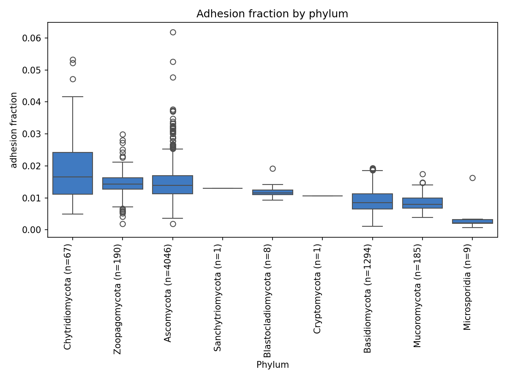
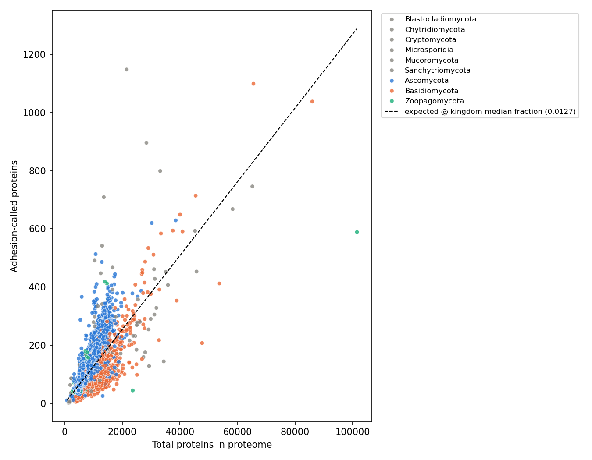
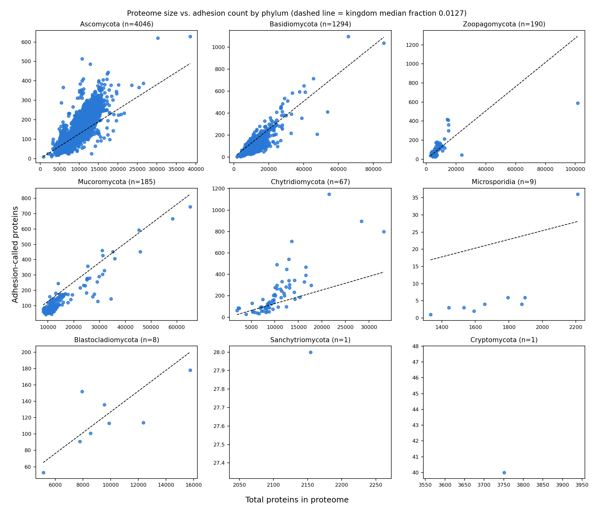
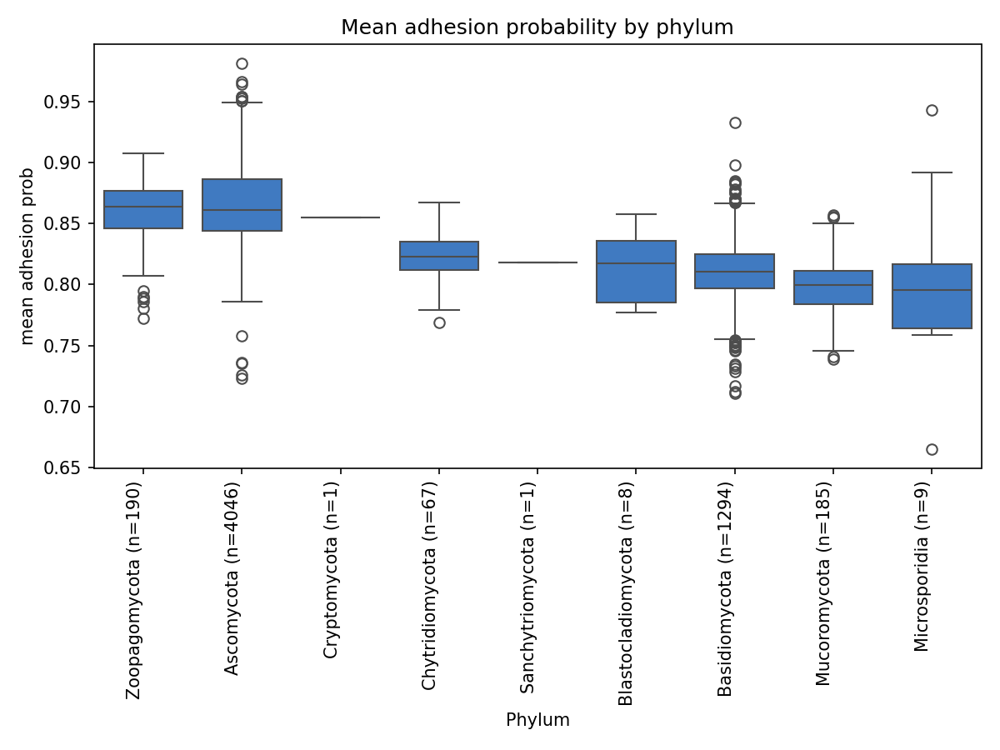
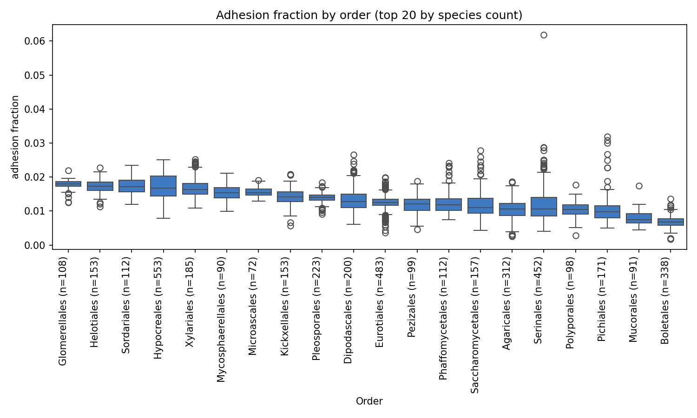
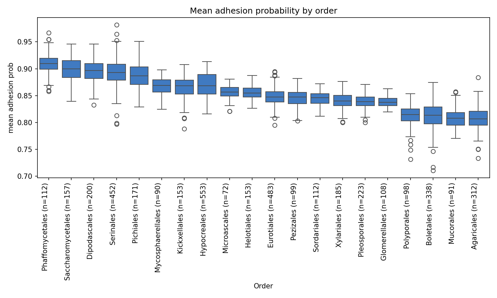

# Kingdom-wide Fungal Adhesion Protein Survey

## Scope

- 5802 species successfully joined to taxonomy and proteome-size data.
- 0 species excluded (no LOCUSTAG match or missing .fai) — see `tables/unmatched_species.csv`.
- 1 species excluded for a mismatched protein-annotation source — see `tables/mismatched_locustag.csv`.
- 10 species in Fungi_5k have no `adhesion_predict` result file at all — see `tables/missing_results.csv`.

## Headline findings

At the phylum level (well-powered groups, n≥5), Chytridiomycota has the
highest median `adhesion_fraction` (0.0166, n=67 species) and
Microsporidia the lowest (0.0021, n=9); this top/bottom ordering is
unchanged after collapsing species to one value per genus (genus-averaged:
Chytridiomycota 0.0164, n=41 genera; Microsporidia 0.0023, n=6 genera), so
it is not simply an artifact of repeated intra-genus sampling. The phylum
omnibus Kruskal-Wallis test is highly significant either way (naive:
H=1.59e+03, p≈0, epsilon-squared=0.274, n_groups=7; genus-averaged:
H=478, p=5.44e-100, epsilon-squared=0.365) — the genus-averaged effect
size is, if anything, larger, arguing against oversampling as the driver
of the phylum-level signal. At the order level the separation is sharper:
Neocallimastigales (n=8 species) has the single highest median
`adhesion_fraction` (0.0387) and stays on top after genus-averaging
(0.0417, n=5 genera), and the order-level omnibus effect size exceeds the
phylum-level one in both the naive view (H=3.55e+03, epsilon-squared=0.637,
n_groups=84) and the genus-averaged view (H=765, p=2.28e-126,
epsilon-squared=0.714, n_groups=55). The bottom of the order ranking
diverges between the two methods, however: naively, Malasseziales has the
lowest median `adhesion_fraction` among well-powered orders (0.0027,
n=20 species), but under genus-averaging its species collapse into too
few distinct genera to remain in the well-powered set at all (flagged
`small_n`), and the lowest well-powered genus-averaged order becomes
Ustilaginales (0.0052, n=12 genera) instead — a likely oversampling
artifact of Malasseziales specifically, not a robust bottom-of-ranking
signal. Note that the phylum boxplot below does not visually distinguish
its two small-N phyla (Sanchytriomycota, Cryptomycota; both n=1) from the
well-powered ones — a box built from a single point has no visible box
area — so that N imbalance is only legible from the tables, not the
figure itself.

The scatter above highlights only the 3 largest phyla by species count
(Ascomycota, Basidiomycota, Zoopagomycota) in distinct colors, with every
other phylum folded into muted gray "Other" — a dense, overlapping
all-pairs scatter cannot safely distinguish more than 3 categorical
colors at once (see `figures.py`'s module docstring), so showing all 9
phyla's own point clouds is left to the small-multiples version below.

## By phylum

Naive per-species test: H=1.59e+03, p=0, epsilon-squared=0.274, n_groups=7.

Genus-averaged test: H=478, p=5.44e-100, epsilon-squared=0.365.

| phylum | n_species | median_fraction | median_count | median_prob |
| --- | --- | --- | --- | --- |
| Chytridiomycota | 67 | 0.0166 | 156.0000 | 0.8226 |
| Zoopagomycota | 190 | 0.0143 | 88.5000 | 0.8637 |
| Ascomycota | 4046 | 0.0140 | 130.0000 | 0.8610 |
| Sanchytriomycota † | 1 | 0.0130 | 28.0000 | 0.8183 |
| Blastocladiomycota | 8 | 0.0116 | 113.5000 | 0.8173 |
| Cryptomycota † | 1 | 0.0107 | 40.0000 | 0.8549 |
| Basidiomycota | 1294 | 0.0085 | 89.0000 | 0.8104 |
| Mucoromycota | 185 | 0.0080 | 94.0000 | 0.7993 |
| Microsporidia | 9 | 0.0021 | 4.0000 | 0.7956 |

## By order (all orders; figures below show top 20 by species count)

Naive per-species test: H=3.55e+03, p=0, epsilon-squared=0.637, n_groups=84.

| order | n_species | median_fraction | median_count | median_prob |
| --- | --- | --- | --- | --- |
| Neocallimastigales | 8 | 0.0387 | 625.5000 | 0.8135 |
| Orbiliales | 25 | 0.0321 | 339.0000 | 0.8913 |
| Basidiobolales † | 3 | 0.0252 | 361.0000 | 0.8417 |
| Chaetomellales † | 1 | 0.0231 | 186.0000 | 0.8354 |
| Dothideales | 32 | 0.0220 | 199.5000 | 0.8781 |
| Trypetheliales | 7 | 0.0218 | 222.0000 | 0.8604 |
| Chytridiales | 21 | 0.0214 | 245.0000 | 0.8277 |
| Entomophthorales | 8 | 0.0200 | 169.0000 | 0.8348 |
| Myriangiales | 9 | 0.0200 | 182.0000 | 0.8607 |
| Coniochaetales | 9 | 0.0197 | 194.0000 | 0.8608 |
| Harpellales | 8 | 0.0193 | 156.0000 | 0.8519 |
| Physodermatales † | 1 | 0.0192 | 152.0000 | 0.7767 |
| Alloascoideales † | 2 | 0.0191 | 154.5000 | 0.8970 |
| Phacidiales † | 3 | 0.0190 | 180.0000 | 0.8534 |
| Lulworthiales † | 1 | 0.0179 | 179.0000 | 0.8510 |
| Glomerellales | 108 | 0.0179 | 225.0000 | 0.8377 |
| Botryosphaeriales | 44 | 0.0178 | 217.5000 | 0.8425 |
| Chaetosphaeriales † | 2 | 0.0175 | 253.0000 | 0.8462 |
| Microthyriales † | 1 | 0.0175 | 200.0000 | 0.8343 |
| Helotiales | 153 | 0.0173 | 201.0000 | 0.8547 |
| Phaeotrichales † | 1 | 0.0172 | 136.0000 | 0.8395 |
| Sordariales | 112 | 0.0172 | 164.0000 | 0.8462 |
| Cladosporiales | 30 | 0.0171 | 196.0000 | 0.8570 |
| Magnaporthales | 24 | 0.0171 | 183.0000 | 0.8354 |
| Aulographales † | 2 | 0.0170 | 180.0000 | 0.8751 |
| Ostropales | 5 | 0.0170 | 159.0000 | 0.8406 |
| Togniniales † | 1 | 0.0170 | 229.0000 | 0.8467 |
| Xylobotryales † | 1 | 0.0170 | 156.0000 | 0.8558 |
| Calosphaeriales † | 1 | 0.0169 | 198.0000 | 0.8577 |
| Hypocreales | 553 | 0.0168 | 191.0000 | 0.8683 |
| Trapeliales | 12 | 0.0166 | 144.5000 | 0.8753 |
| Cephalothecales † | 2 | 0.0164 | 172.5000 | 0.8453 |
| Rhizocarpales † | 1 | 0.0163 | 140.0000 | 0.8732 |
| Xylariales | 185 | 0.0163 | 187.0000 | 0.8400 |
| Racodiales † | 1 | 0.0163 | 231.0000 | 0.8300 |
| Coronophorales † | 3 | 0.0161 | 378.0000 | 0.8208 |
| Diaporthales | 67 | 0.0160 | 203.0000 | 0.8225 |
| Valsariales † | 1 | 0.0159 | 120.0000 | 0.8673 |
| Marthamycetales † | 1 | 0.0159 | 162.0000 | 0.8517 |
| Pneumocystales | 7 | 0.0157 | 51.0000 | 0.7359 |
| Lecanorales | 30 | 0.0157 | 158.5000 | 0.8540 |
| Caliciales † | 3 | 0.0156 | 165.0000 | 0.8520 |
| Thelebolales | 27 | 0.0156 | 155.0000 | 0.8137 |
| Ascoideales | 29 | 0.0156 | 89.0000 | 0.8811 |
| Mycosphaerellales | 90 | 0.0154 | 167.0000 | 0.8690 |
| Ophiostomatales | 68 | 0.0154 | 124.0000 | 0.8719 |
| Microascales | 72 | 0.0154 | 111.0000 | 0.8567 |
| Trigonopsidales | 15 | 0.0153 | 77.0000 | 0.9077 |
| Mytilinidiales † | 3 | 0.0150 | 180.0000 | 0.8633 |
| Hysterangiales † | 1 | 0.0149 | 227.0000 | 0.8308 |
| Cladochytriales † | 4 | 0.0149 | 168.5000 | 0.8270 |
| Venturiales | 13 | 0.0148 | 161.0000 | 0.8645 |
| Hysteriales † | 2 | 0.0148 | 185.5000 | 0.8373 |
| Patellariales † | 1 | 0.0148 | 126.0000 | 0.8741 |
| Phaeomoniellales † | 2 | 0.0146 | 127.0000 | 0.8539 |
| Pyrenulales † | 2 | 0.0146 | 169.0000 | 0.8428 |
| Leucosporidiales † | 3 | 0.0144 | 129.0000 | 0.8206 |
| Ramicandelaberales † | 1 | 0.0144 | 120.0000 | 0.8592 |
| Lobulomycetales † | 2 | 0.0144 | 123.5000 | 0.8188 |
| Paraglomerales † | 2 | 0.0143 | 169.5000 | 0.8007 |
| Pertusariales † | 3 | 0.0143 | 157.0000 | 0.8693 |
| Kickxellales | 153 | 0.0142 | 84.0000 | 0.8684 |
| Lineolatales † | 1 | 0.0142 | 107.0000 | 0.8694 |
| Sarrameanales † | 2 | 0.0141 | 105.0000 | 0.8554 |
| Acrospermales † | 1 | 0.0141 | 137.0000 | 0.8502 |
| Pleosporales | 223 | 0.0140 | 155.0000 | 0.8387 |
| Tilletiales | 8 | 0.0139 | 113.5000 | 0.8509 |
| Capnodiales | 6 | 0.0138 | 118.0000 | 0.8810 |
| Phyllachorales † | 1 | 0.0137 | 97.0000 | 0.8477 |
| Auriculariales | 8 | 0.0136 | 195.0000 | 0.8122 |
| Leotiales † | 2 | 0.0135 | 110.0000 | 0.8758 |
| Rhizophydiales | 10 | 0.0133 | 85.0000 | 0.8350 |
| Trichosporonales | 62 | 0.0133 | 105.0000 | 0.8007 |
| Sebacinales | 11 | 0.0131 | 121.0000 | 0.7915 |
| Coniocybales † | 2 | 0.0130 | 94.0000 | 0.8590 |
| Sanchytriales † | 1 | 0.0130 | 28.0000 | 0.8183 |
| Geastrales † | 1 | 0.0129 | 307.0000 | 0.8242 |
| Umbilicariales | 11 | 0.0128 | 114.0000 | 0.8711 |
| Peltigerales † | 4 | 0.0127 | 132.5000 | 0.8412 |
| Dipodascales | 200 | 0.0127 | 72.0000 | 0.8963 |
| Rhizophlyctidales † | 2 | 0.0127 | 140.5000 | 0.8353 |
| Trechisporales † | 2 | 0.0126 | 124.5000 | 0.8331 |
| Cantharellales | 36 | 0.0126 | 165.0000 | 0.8071 |
| Eurotiales | 483 | 0.0126 | 136.0000 | 0.8472 |
| Corticiales † | 3 | 0.0125 | 121.0000 | 0.8075 |
| Saccharomycodales | 23 | 0.0125 | 49.0000 | 0.9161 |
| Vezdaeales † | 2 | 0.0124 | 83.0000 | 0.8624 |
| Phallales † | 4 | 0.0123 | 161.5000 | 0.8241 |
| Polychytriales † | 1 | 0.0122 | 187.0000 | 0.8127 |
| Amylocorticiales † | 2 | 0.0122 | 120.5000 | 0.8156 |
| Arthoniales † | 3 | 0.0122 | 92.0000 | 0.8632 |
| Pezizales | 99 | 0.0121 | 130.0000 | 0.8472 |
| Acarosporales † | 4 | 0.0121 | 97.0000 | 0.8604 |
| Thelocarpales † | 2 | 0.0119 | 74.5000 | 0.8369 |
| Lichinales | 5 | 0.0118 | 74.0000 | 0.8551 |
| Taphrinales | 16 | 0.0118 | 70.0000 | 0.8612 |
| Phaffomycetales | 112 | 0.0118 | 68.0000 | 0.9094 |
| Candelariales † | 4 | 0.0117 | 91.5000 | 0.8629 |
| Atheliales † | 3 | 0.0116 | 262.0000 | 0.7919 |
| Blastocladiales | 7 | 0.0114 | 113.0000 | 0.8259 |
| Tremellales | 64 | 0.0113 | 80.0000 | 0.8160 |
| Teloschistales | 22 | 0.0112 | 106.5000 | 0.8655 |
| Diversisporales | 12 | 0.0111 | 417.5000 | 0.8187 |
| Saccharomycetales | 157 | 0.0110 | 60.0000 | 0.8999 |
| Kriegeriales † | 4 | 0.0109 | 83.0000 | 0.8282 |
| Zoopagales | 11 | 0.0108 | 67.0000 | 0.8221 |
| Eremomycetales † | 1 | 0.0106 | 87.0000 | 0.8446 |
| Agaricales | 312 | 0.0106 | 131.0000 | 0.8068 |
| Serinales | 452 | 0.0106 | 57.0000 | 0.8931 |
| Sareales † | 1 | 0.0105 | 78.0000 | 0.8618 |
| Symbiotaphrinales † | 1 | 0.0105 | 87.0000 | 0.8830 |
| Polyporales | 98 | 0.0104 | 118.0000 | 0.8149 |
| Chaetothyriales | 63 | 0.0104 | 114.0000 | 0.8652 |
| Spizellomycetales | 9 | 0.0103 | 89.0000 | 0.8206 |
| Geoglossales | 7 | 0.0103 | 94.0000 | 0.8438 |
| Glomerales | 12 | 0.0100 | 273.5000 | 0.7887 |
| Alaninales | 17 | 0.0098 | 58.0000 | 0.8886 |
| Pichiales | 171 | 0.0097 | 50.0000 | 0.8866 |
| Agaricostilbales † | 3 | 0.0097 | 69.0000 | 0.7941 |
| Endogonales † | 4 | 0.0096 | 148.5000 | 0.7762 |
| Umbelopsidales | 6 | 0.0095 | 81.0000 | 0.8093 |
| Archaeosporales † | 3 | 0.0094 | 173.0000 | 0.8023 |
| Dacrymycetales † | 4 | 0.0094 | 91.0000 | 0.7996 |
| Xylonales † | 1 | 0.0094 | 68.0000 | 0.8905 |
| Hymenochaetales | 22 | 0.0094 | 100.5000 | 0.8065 |
| Onygenales | 71 | 0.0093 | 74.0000 | 0.8485 |
| Gloeophyllales † | 3 | 0.0091 | 87.0000 | 0.8132 |
| Erythrobasidiales † | 2 | 0.0091 | 92.0000 | 0.8000 |
| Geminibasidiales † | 1 | 0.0091 | 78.0000 | 0.7998 |
| Dimargaritales | 6 | 0.0088 | 72.5000 | 0.8210 |
| Verrucariales † | 2 | 0.0088 | 82.0000 | 0.8732 |
| Microbotryales | 7 | 0.0087 | 62.0000 | 0.8258 |
| Sporidiobolales | 28 | 0.0087 | 60.5000 | 0.8109 |
| Holtermanniales † | 2 | 0.0082 | 55.5000 | 0.8066 |
| Caulochytriales † | 1 | 0.0081 | 47.0000 | 0.8044 |
| Golubeviales † | 4 | 0.0081 | 61.5000 | 0.7666 |
| Monoblepharidales † | 3 | 0.0080 | 100.0000 | 0.7948 |
| Filobasidiales | 25 | 0.0080 | 51.0000 | 0.8119 |
| Cystobasidiales | 12 | 0.0080 | 55.5000 | 0.8086 |
| Synchytriales † | 2 | 0.0080 | 59.0000 | 0.8335 |
| Sporopachydermiales † | 3 | 0.0079 | 39.0000 | 0.8852 |
| Cystofilobasidiales | 19 | 0.0079 | 50.0000 | 0.8200 |
| Jaapiales † | 1 | 0.0079 | 90.0000 | 0.7920 |
| Mortierellales | 53 | 0.0077 | 90.0000 | 0.7793 |
| Pucciniales | 24 | 0.0077 | 106.0000 | 0.8048 |
| Atractiellales † | 1 | 0.0077 | 109.0000 | 0.8127 |
| Neolectales † | 1 | 0.0076 | 36.0000 | 0.8548 |
| Mucorales | 91 | 0.0074 | 85.0000 | 0.8079 |
| Violaceomycetales † | 1 | 0.0071 | 47.0000 | 0.7652 |
| Exobasidiales | 6 | 0.0071 | 50.5000 | 0.8213 |
| Gomphales | 6 | 0.0070 | 99.5000 | 0.8108 |
| Microstromatales | 6 | 0.0069 | 41.5000 | 0.8203 |
| Cyphobasidiales † | 1 | 0.0069 | 40.0000 | 0.7861 |
| Lipomycetales | 35 | 0.0068 | 42.0000 | 0.8704 |
| Boletales | 338 | 0.0068 | 73.0000 | 0.8133 |
| Mixiales † | 1 | 0.0066 | 40.0000 | 0.8019 |
| Entylomatales † | 1 | 0.0064 | 39.0000 | 0.8294 |
| Russulales | 65 | 0.0064 | 75.0000 | 0.8199 |
| Peribolosporales † | 2 | 0.0062 | 40.0000 | 0.8004 |
| Urocystidales † | 3 | 0.0062 | 31.0000 | 0.7825 |
| Ceraceosorales † | 2 | 0.0061 | 41.0000 | 0.8050 |
| Herpomycetales † | 1 | 0.0061 | 25.0000 | 0.8335 |
| Entrophosporales † | 2 | 0.0060 | 125.0000 | 0.7741 |
| Schizosaccharomycetales | 7 | 0.0057 | 28.0000 | 0.8215 |
| Erysiphales | 14 | 0.0052 | 37.5000 | 0.8347 |
| Moniliellales † | 1 | 0.0050 | 86.0000 | 0.8004 |
| Ustilaginales | 47 | 0.0050 | 32.0000 | 0.7915 |
| Thelephorales | 5 | 0.0045 | 44.0000 | 0.8163 |
| Wallemiales † | 3 | 0.0037 | 18.0000 | 0.7800 |
| Malasseziales | 20 | 0.0027 | 10.0000 | 0.8148 |
| Georgefischeriales † | 1 | 0.0020 | 11.0000 | 0.8037 |

† = small-N (n < MIN_GROUP_N), descriptive only, excluded from formal tests.

## Pseudo-phylogenetic correction (mixed model)

A third view alongside naive per-species and genus-averaged tests: a
linear mixed model of `adhesion_fraction ~ C(rank)` with genus as a
random intercept, fit on the same MIN_GROUP_N-filtered species subset as
the other two views (see `stats.py`'s `mixedlm_by_rank`). This
approximates a phylogenetic correction using genus membership as a proxy
for shared ancestry (no real branch lengths). For each rank:

- **phylum**: converged. Genus variance component = 1.29e-05, residual variance component = 5.55e-06 (genus variance is ~2.3x the residual variance for phylum, indicating substantial non-independence within genus). Full model summary: `tables/mixedlm_by_phylum_summary.txt`.
- **class**: converged. Genus variance component = 6.46e-06, residual variance component = 5.54e-06 (genus variance is ~1.2x the residual variance for class, indicating substantial non-independence within genus). Full model summary: `tables/mixedlm_by_class_summary.txt`.
- **order**: converged. Genus variance component = 3.97e-06, residual variance component = 5.49e-06 (genus variance is ~0.72x the residual variance for order (smaller than the residual, but still a non-negligible share of the total variance, so some non-independence within genus remains)). Full model summary: `tables/mixedlm_by_order_summary.txt`.

Full model output (coefficients, standard errors, z-values) for each rank
is in `tables/mixedlm_by_{phylum,class,order}_summary.txt`.

## Family/genus drill-down

**Exploratory / hypothesis-generating — not a pre-registered test.** The
generated `stats_by_order*.csv` tables carry an omnibus epsilon-squared
for the order-level test as a whole (see "By order" above), not a
per-order epsilon-squared broken out group-by-group, so a literal
"top-3-orders-by-epsilon-squared" ranking cannot be read off these
tables. What genuinely is available and used here instead: the top 3
well-powered orders (n≥5, not flagged `small_n`) by median
`adhesion_fraction` from `tables/stats_by_order.csv` — Neocallimastigales
(0.0387, n=8), Orbiliales (0.0321, n=25), and Dothideales (0.0220, n=32)
— broken down by family/genus directly from
`tables/species_adhesion_summary.csv`:

- **Neocallimastigales** (all 8 species in family Neocallimastigaceae —
  the order is monofamilial in this dataset): genus medians range from
  *Pecoramyces* (n=1, median 0.0533) and *Piromyces* (n=3, median 0.0472)
  down to *Neocallimastix* (n=2, median 0.0278) and *Anaeromyces* (n=1,
  median 0.0357), with *Caecomyces* (n=1, median 0.0417) in between — the
  whole order is elevated, but every genus here has n≤3 species, so none
  of these within-order genus differences should be read as more than
  suggestive.
- **Orbiliales** (all 25 species in family Orbiliaceae): the highest
  genus median is *Dactylellina* (n=6, median 0.0371), followed by
  *Orbilia* (n=6, median 0.0323) and *Arthrobotrys* (n=9, median 0.0309),
  with *Dactylella* (n=1, median 0.0243) and *Drechslerella* (n=3, median
  0.0191) lower — i.e. the nematode-trapping genera *Dactylellina* and
  *Arthrobotrys* anchor the high end of this order.
- **Dothideales** (32 species across 4 named families, plus 1 species with
  no family-level taxonomy assigned) is dominated by a single
  family/genus: *Aureobasidium* (family Saccotheciaceae) contributes 26
  of the 32 species with median 0.0223, well above the order's other
  named families/genera (Dothioraceae n=2 median 0.0194; Dothideaceae n=1
  median 0.0181; Zalariaceae/*Zalaria* n=2 median 0.0158) — so Dothideales'
  elevated order-level median is largely a single-genus (*Aureobasidium*)
  signal, not a broad order-wide pattern.

## Caveats

1. **Non-independence beyond genus.** Genus-averaging and a genus-random-
   intercept mixed model correct for oversampled genera, but neither uses
   real branch lengths or divergence times — a true phylogenetic
   comparative method would. Residual non-independence above the genus
   level (shared family/order ancestry) is not corrected for here.
2. **Annotation quality varies by genome** and could confound raw counts;
   mitigated partly by using `adhesion_fraction`, not raw count alone.
3. **Classifier training-set bias.** The model was trained on a small
   positive set (FLO/ALS1-like proteins from *Saccharomyces*/*Candida*);
   it may under-call adhesion-like proteins in very divergent lineages
   whose domains don't resemble the training set. Treat phyla with
   unusually low fractions as a training-bias hypothesis to test, not
   automatically a biological conclusion.
4. **Taxonomic sampling is wildly unbalanced** (phylum N ranges from
   thousands down to 1); Kruskal-Wallis reads as significant on almost
   any real difference at this scale, so epsilon-squared effect size is
   the headline statistic here, not the p-value alone. Groups with
   N < 5 are excluded from formal statistical tests and are colored
   distinctly from well-sampled groups in the code, though for the
   smallest groups (n=1) a boxplot has no visible fill area to show that
   color on — see the note under Headline findings for the specific case
   observed in this run.
5. **`adhesion_fraction` is fixed to the model's internal 0.5 probability
   threshold.** Results files contain only positive calls, so no
   threshold-sensitivity analysis is possible from existing data — a
   different cutoff could shift which clades look "enriched."

## Follow-up

A phylogeny-aware re-analysis (real branch lengths from `nf_phyling`
output or another tree source, e.g. phylogenetic ANOVA / PGLS) is the
natural next step once a tree is available for this species set.
