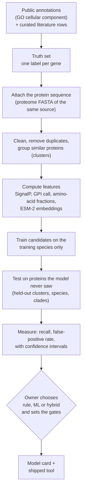
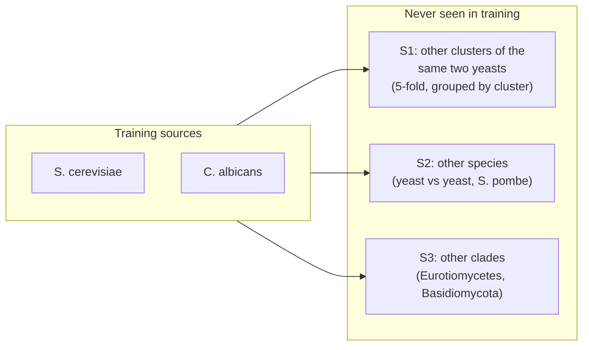
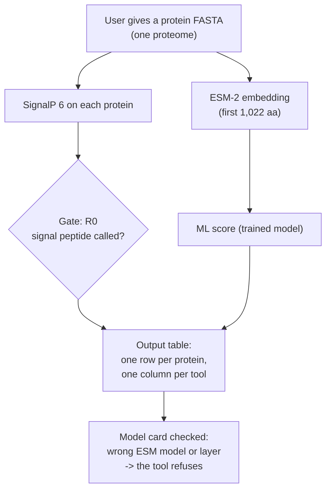

# Step 1 in plain language: what we build, from what data, and how we check it

*Written 2026-10-02 for the owner and for reviewers. It summarises the step 1 spec, the Phase C
evaluation, and the #50 work. It adds no new decision. When this page and a spec differ, the spec wins.
Every number here comes from a repo file or a run output, and the source is named.*

**Read this page first. Then read the specs only for the part you want to check.**

## 1. What step 1 is for

Step 1 asks one question about one protein: **is it outside the cell membrane?** "Outside" means one of
three places: the cell wall, the outer face of the plasma membrane, or secreted into the surroundings.

The tool gives a score. The score predicts **location**. It does not predict:
- that the protein is an adhesin (that is step 2),
- that the protein is glycosylated,
- that the protein triggers an immune response (that is step 3).

An earlier model that was trained on adhesins called many wall proteins that are not adhesins. About 12%
of its calls on *S. cerevisiae* S288C were known adhesins (review of 2026-09-27). So we first build a
reliable "is it on the surface" step, and add the adhesion questions later.

## 2. The big picture

Today we are at box H for most groups. Box I is decided in part (section 7). Box J does not exist yet:
**no trained model ships today.**

## 3. Assumptions

| # | Assumption | Why it matters |
|---|---|---|
| 1 | The label is **location**, taken from GO (Gene Ontology) "cell wall" or "extracellular region" terms. | GO has no term for glycosylation, so we cannot test glycosylation. |
| 2 | We use only GO annotations that a person or an experiment supports. We drop IEA (automatic) annotations. | SignalP and InterPro feed IEA. Using them would test the rule against itself. |
| 3 | "Direct" evidence means the evidence code is not a homology code (IBA, ISS and similar). Headline numbers use direct evidence. | Homology codes copy a label from a related gene. In species far from yeast, most labels are of this kind. |
| 4 | A gene with a surface term **and** an internal term is "ambiguous". We leave it out of training and out of precision. | Some enzymes (for example enolase) sit inside the cell and also on its surface. |
| 5 | A protein with a transmembrane helix (for example MSB2, HKR1) counts as **not surface** (decision Q3). | The owner chose this. It means the model learns "a TM helix means not surface". |
| 6 | UniProt keywords can train a model but never serve as test truth. | They use the same predictors as the rule. |
| 7 | Training uses two yeasts. All other species and clades are test-only. | We want to know if the model works outside yeast. |
| 8 | An unlabelled protein is never a negative. | "Not annotated" does not mean "not on the surface". |
| 9 | We set accuracy gates **after** we measure, not before. | A gate set before measurement is a guess. |
| 10 | The ESM-2 model reads at most 1,022 amino acids. | 164 of 3,573 rows of the UniProt-keyword table are longer than that. |

## 4. Input data

### 4.1 Where the labels come from

Each row is one **source**: one species, one annotation file. The counts are from the step 1 spec,
section 3.3 (measured 2026-10-01 with the D1 rule). "Surface" is P-ext; "inside" is N-int; "secretory,
not surface" is N-sec.

| Source | Role | Surface | Inside | Secretory, not surface | Direct-evidence surface |
|---|---|---|---|---|---|
| *S. cerevisiae* S288C | training | 125 | 2,645 | 1,548 | 88 |
| *C. albicans* SC5314 | training | 259 | 1,772 | 961 | 211 |
| *S. pombe* | test, other species | 59 | 2,962 | 1,214 | 42 |
| *A. fumigatus* Af293 | test, other clade (Eurotiomycetes) | 132 | 2,018 | 1,062 | 23 |
| *A. nidulans* | test, other clade (Eurotiomycetes) | 211 | 2,054 | 1,066 | 113 |
| *C. neoformans* H99 | test, other clade (Basidiomycota) | 11 | 23 | 25 | 9 |
| *U. maydis* | test, other clade (Basidiomycota; role not yet fixed) | 62 | 1,712 | 827 | 10 |
| *C. deneoformans* JEC21 | comparison only | 32 | 1,813 | 817 | 0 |

**What this shows.** Outside the yeasts, the number of direct-evidence surface genes is small. For
Basidiomycota it is 9 plus 10 genes before filtering. This is why #50 exists.

### 4.2 The labels in plain words

| Label | Meaning |
|---|---|
| **P-ext** (positive) | GO says wall or extracellular, with human or experimental support, and no inside term. |
| **P-gpi** (positive) | A P-ext protein that is also in the plasma membrane **and** has curated proof of a GPI anchor. Today only a list. |
| **N-int** (negative, easy) | Inside the cell (cytosol, nucleus, mitochondrion). No membrane or surface term at all. |
| **N-sec** (negative, hard) | In the secretory pathway, membrane or vacuole, but no wall or extracellular term. |
| **PM-TM** (negative) | Surface term, plasma membrane, and a transmembrane helix, without curated GPI proof. |
| **ambiguous** | Surface and inside evidence together. Left out of training. |
| unlabelled | Everything else. Never used as a negative. |

### 4.3 Extra training data

The UniProt-keyword table (`surface.tsv`, 3,573 rows) gives more positives. It is used only in a second
training variant ("V-kw"). Before training, we remove every protein that is a test protein.

## 5. Selection of sequences

1. **Get the sequence.** Each gene ID goes to the proteome FASTA of the same provider. Match counts per
   source are in `sequence_counts.tsv`. Genes with no sequence are listed in `unmatched_ids.tsv`.
2. **Clean it.** Upper case, no spaces, no stop symbol.
3. **Remove exact duplicates** (same SHA-256 hash). A sequence that is both a positive and a negative is
   dropped.
4. **Group similar proteins.** MMseqs2 clusters all labelled proteins from all species together at 30%
   identity and 50% coverage. Related proteins end up in one cluster.
5. **Split by cluster, not by protein.** A cluster is never split between training and testing. This
   stops the model from scoring well by remembering close relatives.
6. **Long proteins.** The first 1,022 amino acids go to the ESM-2 models (M8, M35). The last 1,022 go to
   the "-C" variants (M8-C, M35-C). Results for proteins longer than 1,022 are reported on their own.

## 6. Selection of models

We build several simple candidates and compare them on the same test data.

| Candidate | What it uses | Plain description |
|---|---|---|
| **B0** | length | a floor: how much does length alone tell? |
| **B1** | 20 amino-acid fractions + length | logistic regression on composition |
| **R0** | SignalP 6 signal-peptide call | rule: "has a signal peptide" |
| **R2** | signal peptide **and** (GPI call **or** Ser+Thr fraction) | stricter rule |
| **M8, M35** | ESM-2 (8M, 35M parameters), layer 6, mean over residues | protein language-model embedding + logistic regression |
| **M8-C, M35-C** | same, on the last 1,022 residues | for long proteins |
| **H** | best ESM variant + SignalP probability + GPI score + Ser+Thr fraction | hybrid in one regression |

(Sources: step 1 spec section 5; `docs/model-review/STATUS.md` for R0 and R2.)

**How we choose.** We do not pick by hand. We measure every candidate on the same held-out data. The
owner then picks one. Today the owner has decided on a **hybrid**: R0 (the signal-peptide call) is the
gate, and an ML model gives a second score. The gate values are not set.

**What we measured so far** (`docs/model-review/STATUS.md`, S1:all, the two yeasts, cross-validation):

| Candidate | Recall (found surface proteins) | False-positive rate (non-secreted proteins called surface) |
|---|---|---|
| R0 | 0.603 | 0.037 |
| R2 | 0.418 | 0.006 |
| B1 | 0.763 | 0.130 |
| M8 | 0.772 | 0.084 |

No ML candidate beats both B1 and R2 on the false-positive rate for non-secreted proteins. This is a
measured result with intervals (95%, resampled by cluster). It is not yet a validated tool.

## 7. Training and testing flow

- **S1:** cross-validation inside the two yeasts, with folds built from clusters.
- **S2:** train on one species, test on another (S. cerevisiae to *C. albicans*, and back; both yeasts to
  *S. pombe*).
- **S3:** train on both yeasts, test on a whole clade (Eurotiomycetes, Basidiomycota). This is the
  hardest test.

**How we report a result.** For each test set we give recall and the false-positive rate with a 95%
interval. We call a test set an **estimate** only when:
- the recall interval half-width is 0.10 or less for every ML candidate and for R2, **and**
- the set has at least 20 direct-evidence positives.

Otherwise it is a **smoke test**: it shows that something works or fails, but it is too small to give a
number. Basidiomycota is a smoke test today (16 positives).

## 8. How the finished tool would be used

This is the **intended** use. It is not built yet, because no trained model ships. The gate (R0 plus an
ML score) is the owner's decision of 2026-10-02. The single output table ("one column per tool") is
only a proposal: the handoff says the orchestrator has no design spec.

- The output is a table with one row per protein. The tool states which clades were tested.
- A **model card** records the ESM model, layer, truncation, data hash and the measured results. The tool
  refuses a model whose settings do not match the card (this part is already on `main`).
- Version 0.2.0 is cut only after a validated model exists.

## 9. What the #50 work adds

Two parts of step 1 have too little checked truth:

| Gap | Today | What we add |
|---|---|---|
| **Basidiomycota** | 16 positives (H99 7, *U. maydis* 9) and 60 negatives. Smoke test. | Literature-curated rows for H99 and *U. maydis*, each with a PMID and the quoted sentence. A first check of FungiDB against the GOA file. |
| **GPI-anchored proteins** | `curated_gpi.tsv` has no rows. | Literature rows with experimental proof of a GPI anchor. A rule: a predicted TM helix does **not** override a curated GPI row unless the owner checks it and sets `override_tm=yes`. |

**What we can and cannot promise.**
- To call Basidiomycota an estimate, we need about 73 direct-evidence positives at today's recalls (a
  binomial approximation; the real number can be 57 to 97). We do not know if the literature has that
  many. If it has fewer, Basidiomycota stays a smoke test, and (decision 10) no model ships.
- GPI rows will fill a list. P-gpi becomes a scored group only in a test set that has 20 or more direct
  P-gpi positives. Under the default bounds only the *C. albicans* test set (37 possible) and the pooled
  yeast cross-validation set (44 possible) can reach that, and only if curation finds enough.
- The curation is literature work. We have no effort estimate.

**Order of work** (the plan has two parts):
1. *Plan 1* (written): step 03 reads the new `curated_gpi.tsv` columns, applies the TM rule, and writes
   two review files.
2. *Curation* (not written): find and check the rows.
3. *Plan 2* (not written): merge curated Basidiomycota rows into the truth set, and report results per
   evidence tier. We write it after the first curated rows exist, so we test it on real rows.

## 10. Status

| Piece | State |
|---|---|
| Truth set from GO (Phase A) | done, on `main` |
| Features and embeddings (Phase B) | done |
| Evaluation of all candidates (Phase C) | done, on `main` (numbers in `STATUS.md`) |
| Choice of rule, ML or hybrid | hybrid decided; gate values not set |
| Trained model that ships | does not exist |
| Basidiomycota curated truth | not started (spec and plan 1 drafted) |
| Curated GPI rows | not started |
| Steps 2 and 3 (adhesion mechanism, purpose) | out of scope here |

## 11. Glossary

| Term | Meaning |
|---|---|
| **Adhesin** | A protein that helps a cell stick to a surface or another cell. |
| **Basidiomycota** | A large group of fungi (for example *Cryptococcus*, *Ustilago*). Not closely related to yeasts. |
| **Clade** | A group of species that share an ancestor. |
| **Cluster (MMseqs2)** | A group of proteins that are similar in sequence. |
| **Cluster bootstrap** | A way to get a confidence interval by resampling whole clusters, not single proteins. |
| **Direct evidence** | Evidence that is not a homology code. The method measured this protein. |
| **Embedding** | A list of numbers that a language model gives for a protein. |
| **ESM-2** | A protein language model. We use the 8M and 35M parameter sizes. |
| **Estimate / smoke test** | A test set with enough positives for a number / one that is too small. See section 7. |
| **FPR (false-positive rate)** | The share of non-surface proteins that the tool wrongly calls surface. |
| **GAF** | A file of GO annotations for one species. |
| **Gate** | An accuracy value that a model must reach before it ships. Set after measurement. |
| **GO (Gene Ontology)** | A vocabulary of terms for what genes do and where their products sit. |
| **GPI anchor** | A lipid that attaches a protein to the outer face of the cell membrane. |
| **Half-width** | Half the width of a confidence interval. 0.10 means the true value is likely within 0.10 of the estimate. |
| **Hash (SHA-256)** | A short fingerprint of a sequence. Same sequence, same hash. |
| **IBA, ISS, IEA** | GO evidence codes: copied by a gene tree, copied by similarity, automatic. IBA and ISS are homology codes. |
| **IDA, HDA** | GO evidence codes: direct assay; high-throughput direct assay. |
| **Leave-clade-out** | Train without a whole clade, then test on it. |
| **Logistic regression** | A simple model that turns numbers into a probability. |
| **Model card** | A small file that records how a model was built and tested. |
| **N-int, N-sec, P-ext, P-gpi, PM-TM** | The labels in section 4.2. |
| **override_tm** | A column in `curated_gpi.tsv`. `yes` lets a curated GPI row beat a transmembrane prediction. Only the owner sets it. |
| **PGPI / PredGPI** | A program that predicts GPI anchors. |
| **PMID** | A PubMed article number. |
| **Precision** | The share of the tool's surface calls that are correct. |
| **Recall** | The share of true surface proteins that the tool finds. |
| **SignalP 6** | A program that predicts a signal peptide. |
| **Signal peptide** | A short N-terminal tag that sends a protein into the secretory pathway. |
| **T-a, T-b, T-c** | Evidence tiers: curated GO annotation; literature rows; UniProt keyword. T-c is never test truth. |
| **TM helix** | A transmembrane helix: a stretch of a protein that crosses a membrane. |
| **Truth set** | The table of genes with their labels. |
| **UniProt** | A public protein database. |
